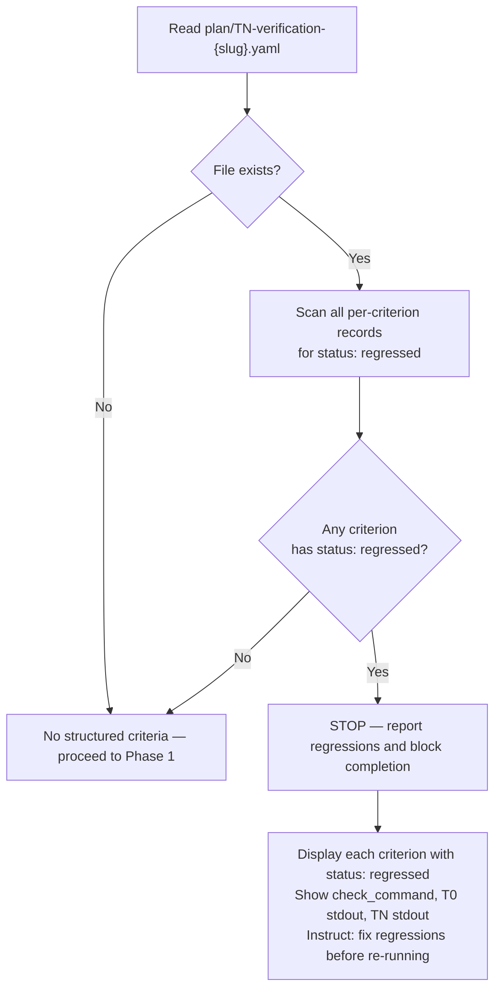

# Complete Implementation (Quality Gates + Recursion)

You MUST validate that the implemented feature meets its goals and quality gates. If follow-up task files are created, route them to backlog items first, then recurse only when the follow-up matches the current scope and priority (see Recursive Follow-up Handling section).

<task_file>
$ARGUMENTS
</task_file>

---

## Resolve Plan Address

Extract the plan address `P{N}` from the task file path:

- `plan/tasks-3-integrate-sam-schema.md` → plan number `3` → address `P3`
- Strip `plan/tasks-` prefix, take the leading integer N, format as `P{N}`

Use `P{N}` in all `sam` CLI calls below.

---

## Pre-Phase 1: TN Verification Check

Before invoking Phase 1, check for a TN verification report produced by `tn-verification-gate` (which reads the T0 baseline written by `t0-baseline-capture`).

Extract `{slug}` from the task file path (`plan/tasks-{N}-{slug}.md` — strip the `tasks-{N}-` prefix and `.md` suffix).

Read `plan/TN-verification-{slug}.yaml`.

The file contains a list of per-criterion `BookendVerification` records — one per `acceptance-criteria-structured` entry. There is no top-level `verdict` field. Aggregate the verdict by scanning all records: the overall result is FAIL if any record has `status: regressed`; otherwise PASS.



If any criterion has `status: regressed`:

1. List each criterion where `status: regressed` with its `check_command`, T0 captured stdout, and TN captured stdout.
2. Output:

```text
COMPLETION BLOCKED — TN Verification Failed

Regressed criteria:
  {criterion-id}: {description}
    command: {check_command}
    T0 result: exit {code}, stdout: {stdout}
    TN result: exit {code}, stdout: {stdout}

Fix the regressions, then re-run /complete-implementation.
```

3. Stop. Do not proceed to Phase 1.

---

## Phase 1: Code Review

Query plan status and pass `TaskAssignment` JSON to `code-reviewer`:

```bash
uv run sam status P{N} --format json
```

Launch `code-reviewer` with the `TaskAssignment` JSON output (not the raw file path).

---

## Phase 2: Feature Verification (goal-backward)

Read task data via sam CLI:

```bash
uv run sam read P{N}/T{M} --format json
```

Launch `feature-verifier` with the `TaskAssignment` JSON. If the `TaskAssignment` contains `issue-classification` metadata, include it in the agent prompt so the feature verifier can apply proportional verification checks.

---

## Phase 3: Integration Check

Launch `integration-checker` with the `TaskAssignment` JSON from `uv run sam read P{N}/T{M} --format json`.

---

## Phase 4: Documentation Drift Audit

Launch `doc-drift-auditor` with the `TaskAssignment` JSON from `uv run sam read P{N}/T{M} --format json` (audit-only).

---

## Phase 5: Documentation Update (if drift found)

If drift exists or docs must be updated for the feature, launch `service-docs-maintainer` with the `TaskAssignment` JSON from `uv run sam read P{N}/T{M} --format json`.

---

## Phase 6: Context Refinement

Launch `context-refinement` with the `TaskAssignment` JSON from `uv run sam read P{N}/T{M} --format json` to update the Context Manifest with discoveries from implementation AND perform a plan artifact freshness check against the feature-context and architect spec. The agent compares key claims in plan artifacts against the actual implementation and classifies findings as design-refinement or intent-divergence (see [.claude/docs/plan-artifact-lifecycle.md](./../../../../.claude/docs/plan-artifact-lifecycle.md)).

---

## Post-Phase-6: Surface Divergence Findings

After Phase 6 completes, check the `context-refinement` agent output for a `DIVERGENCE_REQUIRING_REVIEW` block.

If present, include in the final output to the human:

```text
Plan artifacts have intent divergences requiring your review.
See: [annotated artifact paths from agent output]
Divergences:
  [list from DIVERGENCE_REQUIRING_REVIEW block]
```

This is informational, not blocking. The human reviews at their discretion.
If absent, no additional output is needed — the feature proceeds normally.

---

## Recursive Follow-up Handling

After all six phases complete, route any follow-up task files created by Phase 1 (code-reviewer) to the backlog before deciding on recursion. This ensures no follow-up file is orphaned when the orchestrator skips recursion.

### Step 1: Detect Follow-up Files

Extract file paths from the `Task files:` list in the code-reviewer's ARTIFACTS output (the `STATUS: DONE` block from Phase 1).

If the `Task files:` list is empty or absent, run a confirmatory glob:

```bash
plan/tasks-*-{slug}-followup-*.md
```

Where `{slug}` is extracted from the parent task file path (`plan/tasks-{N}-{slug}.md` -- strip `tasks-{N}-` prefix and `.md` suffix).

If both ARTIFACTS and glob return empty: skip the entire routing section (no follow-ups to route).

**Error handling**: If a glob returns files from a different feature slug, filter results to only include files matching the parent task file's slug.

### Step 2: Search Backlog by Title Keywords

For each follow-up file, derive a search title from the filename using this algorithm:

```text
Input:  plan/tasks-8-data-validation-followup-1.md
Step 1: Strip directory prefix      --> tasks-8-data-validation-followup-1.md
Step 2: Strip .md extension         --> tasks-8-data-validation-followup-1
Step 3: Strip tasks-{N}- prefix     --> data-validation-followup-1
Step 4: Strip -followup-{k} suffix  --> data-validation
Step 5: Replace hyphens with spaces --> data validation
Output: "data validation"
```

Search the backlog for an existing item matching these keywords:

```text
mcp__backlog__backlog_list()
```

Parse the JSON output. For each item, check if the derived title keywords appear (case-insensitive substring match) in the item's `title` field.

**Error handling**: If `mcp__backlog__backlog_list` fails, log the error, skip the search, and proceed to Step 3 as "no match found" for each follow-up. If the follow-up filename does not match the expected `tasks-{N}-{slug}-followup-{k}.md` pattern, log a warning and use the full filename (without directory prefix and `.md` extension) as the derived title.

### Step 3: Link or Create Backlog Item

Based on Step 2 result, for each follow-up file:

**Match found** -- attach follow-up as plan to the existing backlog item:

```text
mcp__backlog__backlog_update(selector="{matched_item_title}", plan="{followup_file_path}")
```

**No match found** -- create a new backlog item, then attach the follow-up as plan:

```text
Skill(skill: "create-backlog-item", args: "--auto {derived_title}")
```

Then attach the follow-up file as the plan:

```text
mcp__backlog__backlog_update(selector="{derived_title}", plan="{followup_file_path}")
```

**Error handling**:

- If `mcp__backlog__backlog_update` fails after creation (title mismatch between what `create-backlog-item` produced and what `update` searched for): re-invoke `mcp__backlog__backlog_list()`, find the most recently added item, and retry `mcp__backlog__backlog_update` with its exact title. If the retry also fails, log the error and continue to the next follow-up file.
- If `create-backlog-item --auto` logs `[AUTO] STOP -- duplicate detected`: treat this as "match found" -- run `mcp__backlog__backlog_update` on the duplicate's title to attach the plan.

### Step 4: Recursion Gate

For each follow-up file, evaluate two conditions. BOTH must be true for recursion.

**Condition 1 -- Same session scope (ADR-3)**: The follow-up file's slug matches the parent task file's slug. Extract the slug from each filename: strip the `tasks-{N}-` prefix, then strip `-followup-{k}.md` for the follow-up or `.md` for the parent. Compare the two slugs.

**Condition 2 -- High priority (ADR-2)**: Read the follow-up file content and extract the `## Priority` section. Only `High` qualifies for immediate recursion.

**If BOTH conditions are met** -- recurse immediately:

```text
Skill(skill="implement-feature", args="{followup_task_file_path}")
```

Then re-run `complete-implementation` on the follow-up task file.

**If EITHER condition is NOT met** -- defer to backlog:

Log the deferral and output this line to the user:

```text
Follow-up deferred — to resume: /work-backlog-item <title>
```

Where `<title>` is the backlog item title the follow-up was linked to in Step 3.

Do not recurse. The follow-up is tracked in the backlog.

**Error handling**: If the follow-up file has no `## Priority` section, default to `Medium` (defer). Log: `No priority found in {followup_path}, defaulting to Medium (deferred).`

---

## Final Step: Commit and Push Remaining Changes

After all phases and follow-up routing are complete, check for uncommitted changes. Phases 1-6 and the Recursive Follow-up Handling steps modify files (task file context manifests, backlog item files, plan annotations). Commit any remaining modifications in a single commit and push to the current branch.

```bash
git status
```

If there are staged or unstaged changes: stage the modified files and commit.

**Issue number in commit message**: Before committing, check the backlog item for the current feature slug:

```text
mcp__backlog__backlog_list(title="{slug}")
```

Check the `issue` field on the matching item. If present and this commit resolves that issue, append `Fixes #NNN` to the commit message body (where NNN is the issue number). If no issue number is found, omit it.

Push after committing. If the working tree is clean, skip this step.

---

## Final Handoff Output

After the commit+push step, output this block to the user:

```text
Clear context and run:
  /work-backlog-item <next-backlog-item-title>
```

Where `<next-backlog-item-title>` is determined by:

```text
mcp__backlog__backlog_list()
```

Find the highest-priority open item whose title contains the current feature slug. If one exists, use its exact title. If none exists, output:

```text
Clear context and run:
  /work-backlog-item — nothing queued —
```
