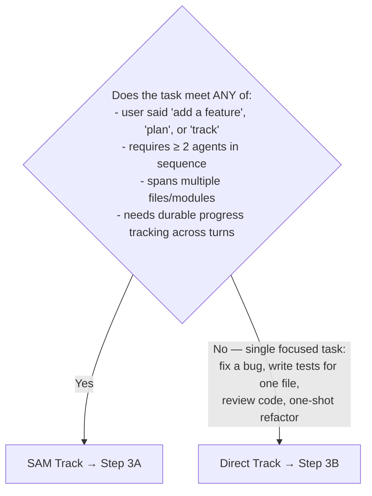
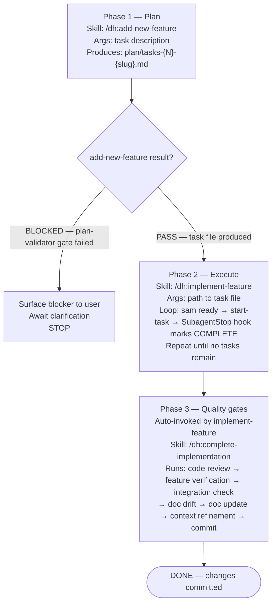

# Task

orchestrate in plugins/python3-development/skills/orchestrate/

If `orchestrate` is empty, derive the task from the conversation so far. If no task can be derived, ask the user to describe what they want built or changed before proceeding.

## Step 1 — Read the orchestration guide (MANDATORY)

Read [Python Development Orchestration Guide](../python3-development/references/python-development-orchestration.md).

Do not proceed to Step 2 until this file has been read. It contains agent selection criteria, workflow patterns, quality gates, and multi-agent chaining patterns you will need to fill in Step 2.

## Step 2 — Route to track



Then state aloud before the first Agent tool call:

```text
Task: <one sentence>
Track: SAM | Direct
Workflow pattern: <TDD | Feature Addition | Refactoring | Debugging | Code Review>
Agent chain: <AGENT1> → <AGENT2> → ...
```

If you cannot fill in workflow pattern and agent chain from the guide read in Step 1, go back and read it.

## Step 3A — SAM Track



## Step 3B — Direct Track

Agent routing — delegate rather than implement:

- Python code → subagent_type="python3-development:python-cli-architect"
- Tests → subagent_type="python3-development:python-pytest-architect"
- Code review → subagent_type="python3-development:python-code-reviewer"
- Architecture design → subagent_type="python3-development:python-cli-design-spec"
- Task breakdown → subagent_type="dh:swarm-task-planner"
- Requirements → subagent_type="spec-analyst"
- Stdlib-only script → Skill(skill: "python3-development:stdlib-scripting")

Each delegation must include:

- Outcomes: what must be true when the agent is done
- Constraints: user requirements, compatibility, scope boundaries
- Known issues: error messages already in context (pass-through, not pre-gathered)
- File paths: where to start looking — not what you found there

Do NOT read source files before delegating. Agents search and read files for themselves — pass file paths, not file contents. Pre-gathering wastes orchestrator context and duplicates work the agent will do anyway.

Track is DONE when all agents in the stated chain have returned their outputs.
