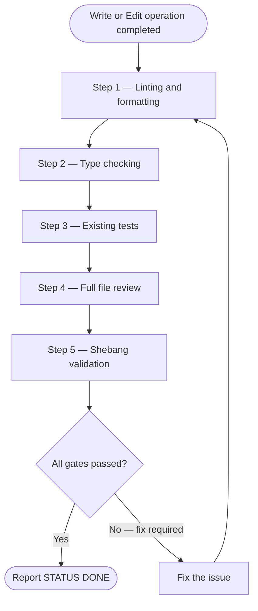

# Task Completion Quality Gate

Run every step below before reporting work complete after any Write or Edit operation.



## Step 1 — Linting and formatting

Detect which hook tool is installed, then run it on every modified file:

```bash
uv run --with prek prek run --files <modified_files>
```

Fallback to ruff only when no `.pre-commit-config.yaml` exists:

```bash
uv run --with ruff ruff format <files>
uv run --with ruff ruff check --fix <files>
```

Fix root causes directly — no `# noqa` suppressions.

### Ruff invocation contexts

```text
Within a project (pyproject.toml present):
  uv run ruff format <file>
  uv run ruff check --fix <file>

Standalone script (no project config):
  uvx ruff check --isolated --select "E,F,UP,B,SIM,I,C90,N,W,PL,PT,RUF" <file>

Uncertain context:
  uv run ruff check --fix <file>
```

## Step 2 — Type checking

Detect project-configured type checker by inspecting `.pre-commit-config.yaml` first, then `pyproject.toml`:

1. `ty` — present when `.pre-commit-config.yaml` contains `id: ty`. Run: `uv run --with ty ty check`
2. `basedpyright` — Run: `uv run basedpyright`
3. `pyright` — Run: `uv run pyright`
4. `mypy` — Run: `uv run mypy`

Zero errors required before continuing.

## Step 3 — Existing tests

```bash
uv run pytest
```

Fix all failures. Minimum 80% coverage. Write missing tests in `tests/test_*.py` following existing project patterns.

## Step 4 — Full file review

Read every file written or edited in full. Verify:

- No truncated sections or incomplete implementations
- Consistent style throughout (naming, indentation, docstring format)
- No missed patterns — compare with similar code in same file/module
- No leftover `TODO` comments that should be implemented

## Step 5 — Shebang validation (standalone scripts only)

For any file with a shebang line:

```text
Skill(skill: "python3-development:shebangpython") on <script_path>
```
