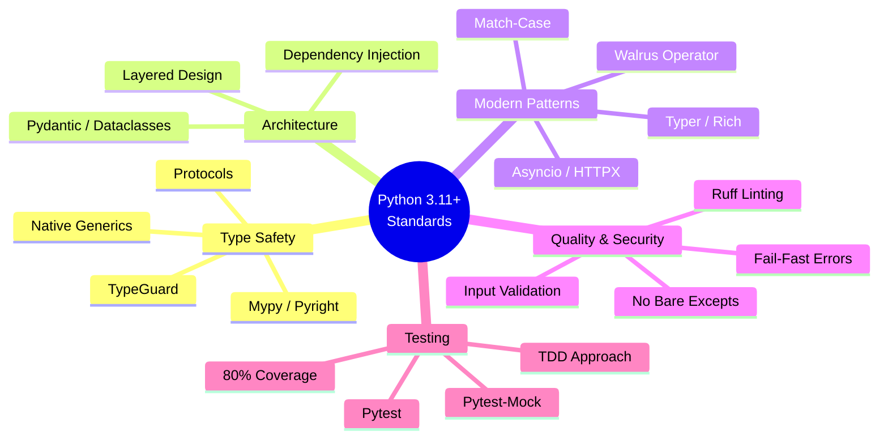

# Python 3 Development Standards & Workflows

This document centralizes the shared Python 3.11+ development standards, quality expectations, and workflows used across all Python agents and skills (including `code-reviewer`, `stinkysnake`, `snakepolish`, and `python3-review`).

## 1. Shared Development Standards

### 1.1 Type Safety & Modern Patterns
- **Native Types**: Use Python 3.11+ native type hints (e.g., `list[str]`, `dict[str, int]`, `str | None`) instead of legacy `typing` imports (`List`, `Dict`, `Optional`, `Union`).
- **Eliminate `Any`**: Replace `Any` with specific types, `TypeVar`, `Generic`, or `Protocol`.
- **Duck Typing**: Use `typing.Protocol` for structural subtyping instead of ABCs where appropriate.
- **Data Structures**: Use `dataclasses` (with `slots=True, frozen=True` when possible), `TypedDict` (with `NotRequired`), or `pydantic` for structured data.
- **Narrowing**: Use `TypeGuard` for runtime type narrowing.
- **Modern Operators**: Utilize the walrus operator (`:=`) and `match-case` statements where they improve readability.

### 1.2 Architecture & Structure
- **Layered Architecture**: Separate concerns into clear boundaries: CLI → Core Logic → Services → Display/UI.
- **Shared Models**: Define data models, constants, and exceptions in a `shared/` or `models/` directory.
- **Dependency Injection**: Use `Protocol` classes to define expected interfaces for external services, allowing easy mocking.
- **Module Hygiene**: Keep functions under 50 lines, avoid deep nesting (>3 levels), prevent circular imports, and define `__all__` in public modules.

### 1.3 Error Handling & Security
- **Fail-Fast**: Catch specific exceptions only when you can recover or add context. Never use bare `except:` or swallow exceptions silently.
- **Contextualize**: Use `e.add_note()` or `raise ... from e` to add context to re-raised exceptions.
- **Security**:
  - Prevent SQL injection (use parameterized queries).
  - Prevent command injection (never use `shell=True` with user input).
  - Validate all external inputs.
  - Never hardcode secrets.

### 1.4 Performance
- **O(1) Lookups**: Use `set` for membership testing instead of `list`.
- **I/O**: Use async patterns (`asyncio`, `httpx`) for I/O-bound operations. Avoid synchronous I/O in async contexts.
- **Caching**: Cache repeated expensive function calls.
- **String Building**: Avoid string concatenation in loops; use `.join()` or list comprehensions.

### 1.5 Testing & Documentation
- **Test-First (TDD)**: Write failing tests against defined interfaces before implementing logic.
- **Framework**: Use `pytest` with `pytest-mock` (avoid `unittest.mock`).
- **Coverage**: Maintain a minimum of 80% test coverage, ensuring edge cases are handled.
- **Docstrings**: Use Google-style docstrings (Args/Returns/Raises) for all public functions and classes.
- **Sync Docs**: Ensure `CLAUDE.md` and architecture documents are updated when adding new commands or modules.

---

## 2. Python Development Knowledge Graph

This graph illustrates the relationships between our core Python concepts, standards, and the tools we use to enforce them.



---

## 3. Python Development Process Graph

This graph shows the lifecycle of Python development, illustrating exactly **where** and **why** each skill/agent is used in the workflow.

```mermaid
flowchart TD
    %% Define Styles
    classDef trigger fill:#e1f5fe,stroke:#3b82f6,stroke-width:2px;
    classDef plan fill:#fff3e0,stroke:#ff9800,stroke-width:2px;
    classDef implement fill:#e8f5e9,stroke:#4caf50,stroke-width:2px;
    classDef verify fill:#f3e5f5,stroke:#9c27b0,stroke-width:2px;

    %% Nodes
    Start([Feature Request / Tech Debt]) ::: trigger

    subgraph Planning Phase
        DesignSpec[python-cli-design-spec<br/>Create Architecture & Interfaces] ::: plan
        StinkySnake[stinkysnake<br/>Analyze & Plan Refactoring] ::: plan
    end

    subgraph Test-Driven Phase
        TestArch[python-pytest-architect<br/>Write Failing Tests] ::: implement
    end

    subgraph Implementation Phase
        CliArch[python-cli-architect<br/>Implement Core Logic] ::: implement
        SnakePolish[snakepolish<br/>Iterative Implement & Test Loop] ::: implement
    end

    subgraph Verification Phase
        StaticAnalysis[Ruff / Mypy<br/>Format, Lint, Type Check] ::: verify
        Review[code-reviewer / python3-review<br/>Holistic Quality & Pattern Check] ::: verify
    end

    Done([Ready for Merge]) ::: trigger

    %% Edges
    Start -->|New Feature| DesignSpec
    Start -->|Refactor Legacy| StinkySnake

    DesignSpec --> TestArch
    StinkySnake --> TestArch

    TestArch -->|Tests Fail| CliArch
    TestArch -->|Tests Fail| SnakePolish

    CliArch --> StaticAnalysis
    SnakePolish --> StaticAnalysis

    StaticAnalysis -->|Pass| Review
    StaticAnalysis -->|Fail| CliArch

    Review -->|Issues Found| CliArch
    Review -->|Approved| Done
```

### Workflow Explanations

1. **Planning Phase**:
   - When building something new, `python-cli-design-spec` creates the architecture and defines the interfaces.
   - When fixing technical debt, `stinkysnake` analyzes the codebase, finds `Any` types, and creates a modernization plan.
2. **Test-Driven Phase**:
   - `python-pytest-architect` reads the interfaces/plans and writes tests *first*. These tests will initially fail.
3. **Implementation Phase**:
   - `python-cli-architect` writes the actual code.
   - `snakepolish` is an automated loop that implements code and runs tests iteratively until the tests pass.
4. **Verification Phase**:
   - Automated static analysis (`ruff`, `mypy`) ensures formatting and type safety.
   - `code-reviewer` (or `python3-review`) performs a holistic, human-like review to ensure the code follows the standards defined in Section 1 (Architecture, Security, Modern Patterns). If it finds issues, it kicks the process back to implementation.
