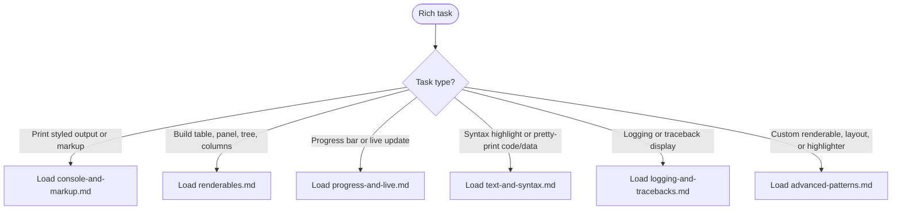

# Rich Knowledge

Enables writing correct Rich terminal UI code — markup, styled output, tables, progress tracking, live displays, logging integration, and custom renderables.

## Scope

Consult `../python3-development/references/python3-standards.md` when applying shared architecture, typing, testing, or CLI rules; full standards, graphs, and amendment process are documented there.

TRIGGER: Activate when writing Python code that imports from `rich` or when asked to add terminal UI, colored output, progress bars, tables, syntax highlighting, or pretty printing to a Python CLI.

COVERS:

- Console class, markup syntax, style strings, color formats
- All renderable types (Panel, Table, Tree, Columns, Layout)
- Progress bars (`track()`, `Progress`) and Live displays
- `RichHandler` for stdlib logging and traceback installation
- `Text` class and programmatic style building
- `Syntax`, `Markdown`, `Pretty` / `pprint`, `JSON`
- `__rich_console__` and `__rich_repr__` protocols for custom objects

DOES NOT COVER:

- Textual (Rich's sibling TUI framework — separate library)
- Rich internals below Segment level
- Pygments theme authoring

## Workflow



## Reference Files

### Console and Markup

Console class instantiation and constructor parameters, `print()` / `log()` / `rule()` / `status()` methods, markup syntax (BBCode-style tags), style definition strings, color formats (named / 256-number / hex / rgb), style attributes (bold/italic/underline/etc.), Style class, Theme class, environment variables, output capture and export.

Load when writing `console.print()`, applying colors/styles, using Rich markup tags, or configuring console behavior.

[console-and-markup.md](./references/console-and-markup.md)

### Renderables

Panel, Table (add_column, add_row, constructor options, column options), Tree (add, style, guide_style), Columns layout, Padding, Rule, Align, and Box styles. Includes constructor signatures and all key parameters verbatim from source docs.

Load when building structured output with boxes, tables, tree views, or multi-column layouts.

[renderables.md](./references/renderables.md)

### Progress and Live

`track()` function, `Progress` class (add_task, update, advance), task management (visible, indeterminate, transient), all built-in column classes (BarColumn, TextColumn, TimeRemainingColumn, SpinnerColumn, etc.), `Live` class, and `console.status()` spinner.

Load when adding progress tracking, spinners, or live-updating output to a CLI.

[progress-and-live.md](./references/progress-and-live.md)

### Text and Syntax

`Text` class (append, stylize, highlight_regex, assemble, from_markup), `Syntax` class (from_path, line_numbers, theme, line_range), `Markdown` renderable, `pprint` / `Pretty`, `JSON` renderable, and the `__rich_repr__` protocol with `@rich.repr.auto` decorator.

Load when highlighting code blocks, rendering markdown, pretty-printing data structures, or customizing object repr output.

[text-and-syntax.md](./references/text-and-syntax.md)

### Logging and Tracebacks

`RichHandler` constructor parameters (full table), per-message markup/highlighter overrides via `extra={}`, `rich_tracebacks=True` for exceptions in log output, `tracebacks_suppress` for framework frames, `traceback.install()` for global handler, `console.print_exception()` parameters, and `max_frames` behavior.

Load when integrating Rich with Python's logging module, installing a global traceback handler, or improving exception display.

[logging-and-tracebacks.md](./references/logging-and-tracebacks.md)

### Advanced Patterns

`__rich__` protocol (return renderable from object), `__rich_console__` protocol (generator yielding renderables or Segments), `__rich_measure__` for custom width reporting, `Layout` class (split_column, split_row, update, named panes), `RegexHighlighter` subclassing, built-in highlighters, `inspect()` function, and REPL installation.

Load when writing custom renderables, building multi-pane full-screen layouts, implementing custom syntax highlighting, or debugging Python objects.

[advanced-patterns.md](./references/advanced-patterns.md)

## Quick Reference

```python
# Install
pip install rich

# Drop-in print replacement
from rich import print
print("[bold red]Hello[/bold red] [green]world[/green]")

# Console (preferred for production code)
from rich.console import Console
console = Console()
console.print("[bold]Hello[/bold]", style="green")
console.rule("[bold red]Section")

# Style string formats
console.print("text", style="bold red underline on white")
console.print("text", style="#af00ff")
console.print("text", style="rgb(175,0,255)")

# Progress bar — simple
from rich.progress import track
for item in track(sequence, description="Processing..."):
    process(item)

# Progress bar — multiple tasks
from rich.progress import Progress
with Progress() as progress:
    task = progress.add_task("[cyan]Working...", total=100)
    progress.update(task, advance=10)

# Logging
import logging
from rich.logging import RichHandler
logging.basicConfig(
    level="NOTSET", format="%(message)s",
    datefmt="[%X]", handlers=[RichHandler()]
)

# Tracebacks
from rich.traceback import install
install(show_locals=True)

# Table
from rich.table import Table
table = Table("Name", "Value")
table.add_row("foo", "bar")
console.print(table)

# Panel
from rich.panel import Panel
console.print(Panel("content", title="Title"))
```
