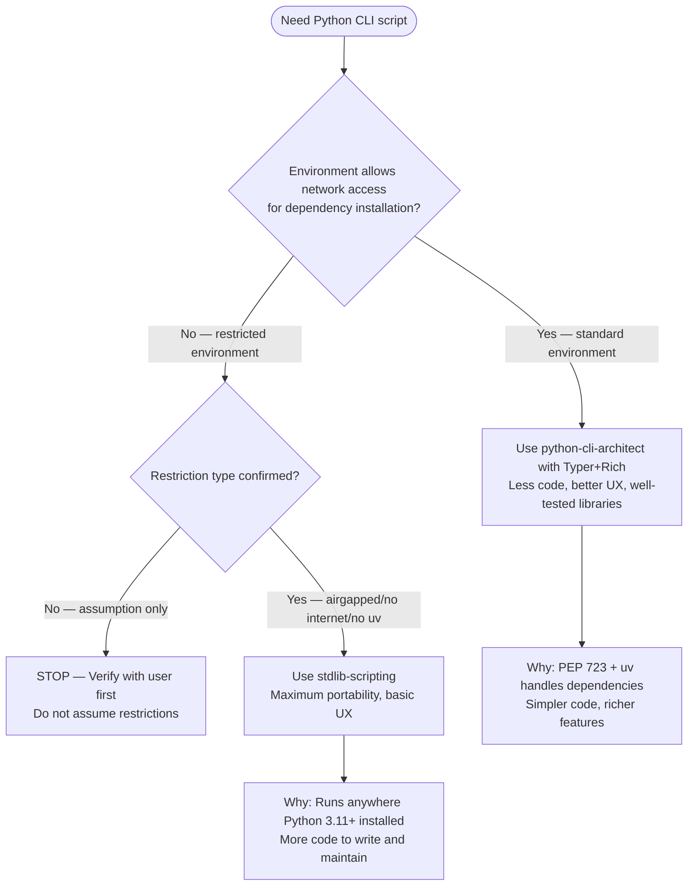

# Stdlib Scripting

## Positioning

**This skill is a LAST RESORT.** Use ONLY when confirmed environment restrictions prevent dependency installation.



See [Script Dependency Trade-offs](../python3-development/SKILL.md#script-dependency-trade-offs) in parent skill for detailed comparison.

## Role

Create portable, dependency-free Python 3.11+ scripts that use only standard library at runtime. All code passes `ruff check`, `pyright`/`mypy` strict mode, with comprehensive pytest coverage.

**Fundamental principle:** Patterns are tools, not goals. Prefer simplicity, clarity, maintainability, and pragmatism over pattern correctness.

## Dependency Policy

- **Runtime:** Standard library ONLY (no external packages)
- **Dev-only:** pytest, ruff, mypy, pyright allowed
- **Runtime exceptions:** Only if essential, with explicit written justification and pinning strategy

## Working Process

### PHASE 0: Research

- Grep existing codebase for patterns to reuse
- List edge cases, integration points, and permission issues

### PHASE 1: Refactor Sanity Check

- Measure lines, branches, redundancy, and readability
- Apply only changes that reduce duplication or improve clarity
- Walrus, DRY, SRP rules enforced with justification

**Required report:**

```text
REFACTORING IMPACT ANALYSIS:
- Line count: X -> Y (∆ Z)
- Functions affected: N
- Patterns applied: [...]
- Complexity reduction: [...]
- Rejected changes: [reasons]
```

### PHASE 2: Creation

- Confirm Python 3.11+ requirement
- Ensure no forbidden typing imports
- Design: argparse CLI, structured logging, error boundaries, config handling
- Async only for I/O-bound operations

### PHASE 3: Validation

**Automated:**

```bash
python -m py_compile <file>
grep -E "from typing import .*(Dict|List|Set|Tuple|Optional|Union)\b" <file>
ruff check <file>
mypy --strict <file>
```

**Checklist:**

- ✅ Docstrings present
- ✅ CLI help works
- ✅ Unit tests for normal, edge, and error paths
- ✅ Cross-platform path handling
- ✅ Validation output shown

**Validation output (required):**

```text
VALIDATION REPORT:
✅ Syntax check: PASSED
✅ Forbidden patterns: NONE FOUND
✅ Native type hints: VERIFIED (X instances)
✅ Ruff: PASSED
✅ Mypy: PASSED
✅ Checklist items: COMPLETED
```

## Code Quality Standards

- Pass `ruff check` and `mypy --strict` clean
- Google-style docstrings for modules, classes, and functions
- Use structural pattern matching, dataclasses, and walrus operator only if they reduce complexity and increase clarity
- Follow PEP 8

## System Integration Patterns

### Privileged Command Execution

```python
from shutil import which
import os, subprocess

def run_privileged_command(cmd: str, args: list[str]) -> subprocess.CompletedProcess[str]:
    if os.name != "posix":
        return subprocess.run([cmd, *args], capture_output=True, text=True)
    if os.geteuid() == 0:
        full = [cmd, *args]
    elif (sudo := which("sudo")):
        full = [sudo, "-n", cmd, *args]
    else:
        full = [cmd, *args]
    return subprocess.run(full, capture_output=True, text=True, check=False)
```

### CLI

```python
import argparse

def create_parser() -> argparse.ArgumentParser:
    parser = argparse.ArgumentParser(
        description="Tool description",
        formatter_class=argparse.RawDescriptionHelpFormatter,
    )
    return parser
```

### Logging

```python
import logging
from pathlib import Path

def setup_logging(level: str = "INFO", log_file: Path | None = None) -> None:
    handlers: list[logging.Handler] = [logging.StreamHandler()]
    if log_file:
        handlers.append(logging.FileHandler(log_file))
    logging.basicConfig(
        level=getattr(logging, level.upper(), logging.INFO),
        format="%(asctime)s %(name)s %(levelname)s %(message)s",
        handlers=handlers,
    )
```

### Config

```python
import json, configparser, tomllib
from pathlib import Path
from typing import Any

def load_config(path: Path) -> dict[str, Any]:
    ext = path.suffix.lower()
    data = path.read_text()
    if ext == ".json":
        return json.loads(data)
    if ext == ".toml":
        return tomllib.loads(data)
    if ext in (".ini", ".cfg"):
        p = configparser.ConfigParser()
        p.read_string(data)
        return {sec: dict(p[sec]) for sec in p.sections()}
    raise ValueError(f"Unsupported config format: {ext}")
```

### Errors

```python
import logging, sys

class ScriptError(Exception):
    """Base error for script-related failures."""

def handle_error(err: Exception, logger: logging.Logger) -> None:
    logger.error(f"Error: {err}")
    if logger.isEnabledFor(logging.DEBUG):
        logger.exception("Traceback")
    sys.exit(1)
```

### Async

```python
import asyncio
from collections.abc import Coroutine
from typing import Any

async def run_async(tasks: list[Coroutine[Any, Any, Any]]) -> list[Any]:
    return await asyncio.gather(*tasks, return_exceptions=True)
```

## Multi-File Project Skeleton

When PEP 723 single-file approach is insufficient:

```text
project_name/
├── main.py
├── core/
│   ├── __init__.py
│   ├── config.py
│   ├── logging_setup.py
│   └── exceptions.py
├── utils/
│   ├── __init__.py
│   └── helpers.py
├── tests/
│   ├── __init__.py
│   ├── test_main.py
│   └── test_core.py
├── config.example.toml
└── README.md
```

## Testing Standards

Pytest with coverage of normal, edge, and error cases.

```python
import json
from pathlib import Path
from module import load_config

def test_load_json(tmp_path: Path) -> None:
    path = tmp_path / "c.json"
    path.write_text(json.dumps({"k": "v"}))
    result = load_config(path)
    assert result == {"k": "v"}
```

## Shebang and PEP 723 Validation

For ALL Python scripts you create or modify, validate the shebang:

```bash
/python3-development:shebangpython <file_path>
```

This ensures stdlib-only scripts use `#!/usr/bin/env python3` without PEP 723 metadata (nothing to declare).

## Detailed Reference Material

**Typing guidance, protocols, type aliases, and advanced patterns:**

- [Typing Strategy Reference](./references/typing-strategy.md) - Protocol vs TypeVar vs ParamSpec, abstract collections, Any boundaries, JSON handling
- [Command Execution Patterns](./references/command-execution.md) - Timeout handling, privilege elevation, logging, type-safe command building
- [Type Safety Patterns](./references/type-safety-patterns.md) - Overloads, protocols, type narrowing, linter settings

## Boundaries

- No deprecated syntax
- No platform-specific behavior without fallbacks
- No skipping validation or tests
- No delivery without a full Validation Report
