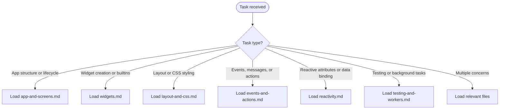

# Textual Knowledge

Provides patterns, API constraints, and working examples for building terminal applications with the Textual framework.

## Scope

Consult `../python3-development/references/python3-standards.md` when applying shared architecture, typing, testing, or CLI rules; full standards, graphs, and amendment process are documented there.

TRIGGER: Activate when the user asks about Textual — building TUI apps, widgets, CSS styling, reactive attributes, testing, or concurrency.

COVERS:

- App class, run/exit/suspend, title/subtitle, CSS loading
- Screen stack (push, pop, switch), modal screens, modes, screen data return
- Custom widgets, builtins, Line API, compound widgets, data flow
- Layout types (vertical, horizontal, grid), docking, layers, offsets
- CSS selectors, pseudo-classes, combinators, specificity, variables, nesting
- Events, message queue, bubbling, custom messages, `@on` decorator
- Actions, action strings, namespaces, bindings, dynamic actions
- Reactive attributes, smart refresh, validation, watch methods, compute, data binding
- Testing with `run_test`, Pilot API (press, click, hover, pause)
- Snapshot testing with `pytest-textual-snapshot`
- Workers (`@work`, `run_worker`, thread workers, worker events)

DOES NOT COVER:

- Rich library internals (see Rich docs)
- Textual Web deployment
- Custom CSS parsers or non-Textual terminal frameworks

## Workflow



## Reference Files

### App and Screens

App class basics, run/exit/suspend, CSS loading, screen stack (push/pop/switch), modal screens, returning data from screens, and modes.

Load when the user asks about App setup, screen navigation, modal dialogs, or multi-screen apps.

`references/app-and-screens.md`

### Widgets

Custom widget creation, Static, Default CSS, focusability, bindings, Rich renderables, Line API, compound widgets, coordinating via messages, and the builtin widget catalog.

Load when the user asks about creating widgets, choosing a builtin widget, or structuring compound UIs.

`references/widgets.md`

### Layout and CSS

Layout types (vertical, horizontal, grid), utility containers, docking, layers, offsets, CSS selectors, pseudo-classes, combinators, specificity, variables, nested CSS, and the style property reference.

Load when the user asks about arranging widgets, CSS syntax, selectors, or style properties.

`references/layout-and-css.md`

### Events and Actions

Message queue, event handler naming convention, `@on` decorator, handler arguments, async handlers, event bubbling, custom messages, preventing messages, actions, action strings, namespaces, key bindings, dynamic actions, and the builtin actions list.

Load when the user asks about handling user input, defining key bindings, creating custom events, or action strings.

`references/events-and-actions.md`

### Reactivity

Reactive attributes, `var`, smart refresh, layout-triggering reactives, validation methods, watch methods, dynamic watchers, recompose, compute methods, `set_reactive`, mutable reactives (`mutate_reactive`), and data binding.

Load when the user asks about reactive state, auto-refresh, watchers, computed values, or binding parent state to child widgets.

`references/reactivity.md`

### Testing and Workers

`run_test`, Pilot API (press, click, hover, pause), terminal size simulation, snapshot testing with `pytest-textual-snapshot`, `run_worker`, the `@work` decorator, worker state lifecycle, thread workers, and worker events.

Load when the user asks about writing tests, simulating input, snapshot comparisons, background HTTP requests, or preventing UI blocking.

`references/testing-and-workers.md`

## Quick Reference

```python
# Minimal app
from textual.app import App, ComposeResult
from textual.widgets import Label

class MyApp(App):
    CSS = "Screen { align: center middle; }"

    def compose(self) -> ComposeResult:
        yield Label("Hello!")

if __name__ == "__main__":
    MyApp().run()
```

```python
# Reactive + watch
from textual.reactive import reactive
from textual.widget import Widget

class Counter(Widget):
    count = reactive(0)

    def watch_count(self, value: int) -> None:
        self.refresh()

    def render(self) -> str:
        return str(self.count)
```

```python
# Worker for background HTTP
from textual import work
import httpx

class MyApp(App):
    @work(exclusive=True)
    async def fetch(self, url: str) -> None:
        async with httpx.AsyncClient() as client:
            response = await client.get(url)
        self.query_one("#result").update(response.text)
```

```python
# Test with Pilot
async def test_button() -> None:
    app = MyApp()
    async with app.run_test() as pilot:
        await pilot.click("#submit")
        assert app.query_one("#result").renderable == "done"
```
