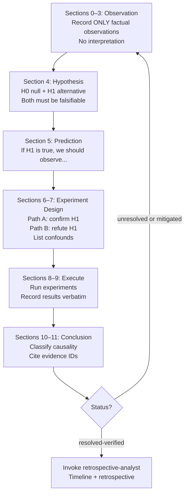

# scientific-method

> Use when debugging, investigating root causes, designing experiments, or performing scientific analysis — enforces hypothesis-driven reasoning, evidence-first observation, causality validation, and structured output templates. Use when facing unknowns, repeated failures, or complex investigations requiring rigorous methodology.

**Version**: 1.4.18 | **Author**: [Jamie Nelson](https://github.com/bitflight-devops)

---

## Why Install This?

When Claude investigates a problem without structure, it:

- Reads code, forms an interpretation, and treats that interpretation as fact
- Jumps to a fix before establishing what actually caused the failure
- Attributes causality without a falsification test ("this must be why it broke")
- Changes multiple variables at once, making it impossible to know what fixed it
- Calls an investigation complete when the symptom is gone, not when the cause is proven

This plugin enforces hypothesis-driven methodology. Every investigation follows the same sequence: observe → hypothesize → predict → test → classify causality → conclude. No step skips forward.

---

## What You Get

### Unified investigation template

All three skills share a 15-section template filled progressively:

**Before execution (sections 0–7)**:
- `0 CONTEXT` — goal, system, environment, baseline
- `1 ISSUE STATEMENT` — symptom, expected vs actual, repro status
- `2 OBSERVATIONS` — raw signals with evidence IDs, truncation disclosed
- `3 FACTS` — evidence-cited statements only (no interpretation)
- `4 HYPOTHESES` — falsifiable H0/H1 pairs with fact references
- `5 PREDICTIONS` — "If H1 is true, we should observe X when we do Y"
- `6 EXPERIMENT PLAN` — Path A (confirm H1) and Path B (refute H1) tests
- `7 CONFOUNDING VARIABLES` — isolation plan

**During and after execution (sections 8–14)**:
- `8 ACTIONS` — commands and changes with evidence IDs
- `9 RESULTS` — observed outcomes verbatim, not summarized
- `10 CAUSALITY CHECK` — each link classified: `causal-supported`, `correlated-only`, `unrelated`, or `unknown`
- `11 CONCLUSION` — reject or fail-to-reject H0, citing evidence IDs
- `12 CHANGES` — diff summary
- `13 VERIFICATION` — verification command and result
- `14 EVIDENCE LOG` — complete evidence inventory

### Hard evidence rules

- Every observation in section 2 must have an evidence ID
- Every fact in section 3 must cite an evidence ID from section 2
- Truncated output must disclose: `total=<N>, shown=<M>, method=<head|tail|grep>`
- Causality classification in section 10 requires a falsification test — intuition is not sufficient

---

## Skills

### `/scientific-method:scientific-thinking`

**When to use**: Starting any investigation — debugging session, unknown root cause, repeated failure, complex problem requiring structured reasoning.

Loads the unified investigation template and guides through all 15 sections. Enforces stage ordering: observations before hypotheses, predictions before experiments, falsification before causality classification.

```text
/scientific-method:scientific-thinking
```

Claude auto-invokes when you describe a debugging problem, unknown failure, or investigation.

---

### `/scientific-method:evidence-first-debugging`

**When to use**: Debugging a specific defect where evidence collection is the immediate priority.

Focuses on sections 2–3 (observations and facts). Enforces observation-before-assumption discipline: raw signals only, verbatim snippets, truncation disclosed. Provides domain extensions for software debugging and performance analysis.

```text
/scientific-method:evidence-first-debugging
```

---

### `/scientific-method:experiment-protocol`

**When to use**: Designing and running controlled experiments — A/B tests, performance benchmarks, configuration comparisons, or any test where variable isolation matters.

Drives the experiment-registry MCP server through a controlled lifecycle. The MCP server owns state validation and methodology enforcement; Claude submits artefacts and advances steps.

```text
/scientific-method:experiment-protocol
```

---

## Agent

### `retrospective-analyst`

Produces structured process-quality artefacts after an investigation reaches `resolved-verified` status:

- Mermaid `sequenceDiagram` timeline — one node per hypothesis and experiment, labelled PASS/FAIL/UNEXPECTED
- Result analysis — what worked, what did not, patterns observed across iterations
- Retrospective — lessons learned, anti-patterns encountered, rubric update recommendations

Invoke after a completed investigation by passing the full investigation output (all 15 sections) as input.

---

## MCP Server — experiment-registry

The plugin registers a FastMCP server that manages experiment state mechanically. Claude calls it via tool calls; the server validates artefacts and enforces the protocol. Experiment state persists to `.claude/experiments/{id}/state.json`.

**Available tools**:

| Tool | Purpose |
|---|---|
| `list_experiment_types` | Lists registered experiment types with names and descriptions |
| `inspect_experiment_type` | Returns full definition for a type — steps, required artefacts, rubric templates, validators |
| `start_experiment` | Creates a new experiment instance, returns the first step definition |
| `get_current_step` | Returns the current step, its required artefacts, and any human input needed |
| `complete_step` | Advances to the next step after submitting artefacts for the current step |
| `list_experiments` | Lists experiments for the current project, optionally filtered by status |

**Content validation**:

The server enforces composable validators on artefact submission:

| Validator | Purpose |
|---|---|
| `non_empty` | Artefact content is not blank |
| `file_exists` | Referenced file path exists in the project |
| `min_length` | Artefact meets minimum character count |
| `frozen` | Hash-based freeze — artefact cannot change once marked complete |
| `rubric_scores` | Structured rubric scoring instead of trust-based self-report |
| `iteration_output` | Output follows prescribed format for the iteration step |

Validation occurs during `complete_step`. Artefacts that fail validation are rejected without state mutation — the step remains incomplete and resubmission is required.

The server enforces sequencing — steps cannot be skipped and artefacts are validated before the experiment advances.

---

## Hooks

A `SubagentStop` hook monitors investigation sub-agent output using a fast Node.js command script (`notify-investigation-complete.cjs`). The script searches the last assistant message for `status: resolved-verified` in section 14. When detected, it notifies you that the `retrospective-analyst` agent is ready to produce a timeline and retrospective.

The hook is informational — it never blocks or modifies agent output. It uses text search only, avoiding LLM round-trips on every subagent stop.

---

## Investigation Workflow



---

## Shared Reference Files

All skills reference canonical files in `shared/`:

| File | Purpose |
|---|---|
| `shared/investigation-template.md` | 15-section unified investigation template |
| `shared/evidence-rules.md` | Rules for evidence collection — raw signals, truncation disclosure, verbatim snippets |
| `shared/causality-check.md` | Causality classification — causal-supported, correlated-only, unrelated, unknown |
| `shared/investigation-workflow.md` | Mermaid workflow diagram for the full investigation lifecycle |
| `shared/extensions/debugging-extensions.md` | Domain extensions for software debugging |
| `shared/extensions/performance-extensions.md` | Domain extensions for performance analysis |

---

## Migration from Previous Skills

| Old invocation | New invocation |
|---|---|
| `/scientific-thinking` | `/scientific-method:scientific-thinking` |
| `/experiment-protocol` | `/scientific-method:experiment-protocol` |
| `/evidence-first-debugging:evidence-first-debugging` | `/scientific-method:evidence-first-debugging` |

Redirect stubs remain at the old locations for backward compatibility.

---

## Installation

First, add the marketplace (one-time setup):

```bash
/plugin marketplace add Jamie-BitFlight/claude_skills
```

Then install the plugin:

```bash
/plugin install scientific-method@jamie-bitflight-skills
```
