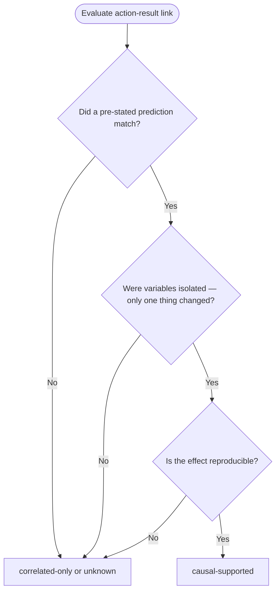

# Causality Gate

Every action-result link must be classified before declaring a conclusion.

## Classification Options

```text
causal-supported
correlated-only
unrelated
unknown
```

## Requirements for causal-supported

All three conditions must be true:

1. **Prediction confirmed** — the observed result matches a pre-stated prediction
2. **Variables isolated** — no other changes occurred between action and result
3. **Effect reproducible** — the result can be obtained again under the same conditions

If any condition is false, classify as `correlated-only` or `unknown`.

## Format

```text
Link L1:
  Action: A#
  Result: R#
  Classification: (causal-supported | correlated-only | unrelated | unknown)
  Reason: [must reference evidence IDs, not intuition]
  Falsification test: [what would disprove the causal claim]
```

## Decision Flowchart



## Anti-Patterns

- Classifying as `causal-supported` when the experiment changed multiple variables simultaneously
- Classifying as `causal-supported` based on a single non-reproducible observation
- Omitting the falsification test
- Writing "root cause is" without a `causal-supported` classification backed by evidence
