# Investigation Workflow

Hypothesis-driven scientific method flow for debugging, research, and root cause analysis.

---

## Overview

When facing unknown problems, pattern-matching from training data can mislead. The investigation workflow applies scientific rigor to ensure conclusions are evidence-based.

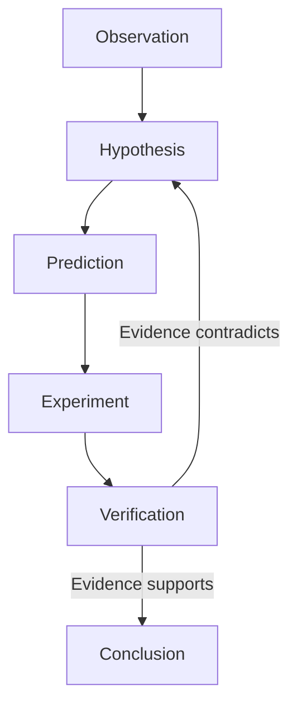

---

## When to Use Investigation Workflow

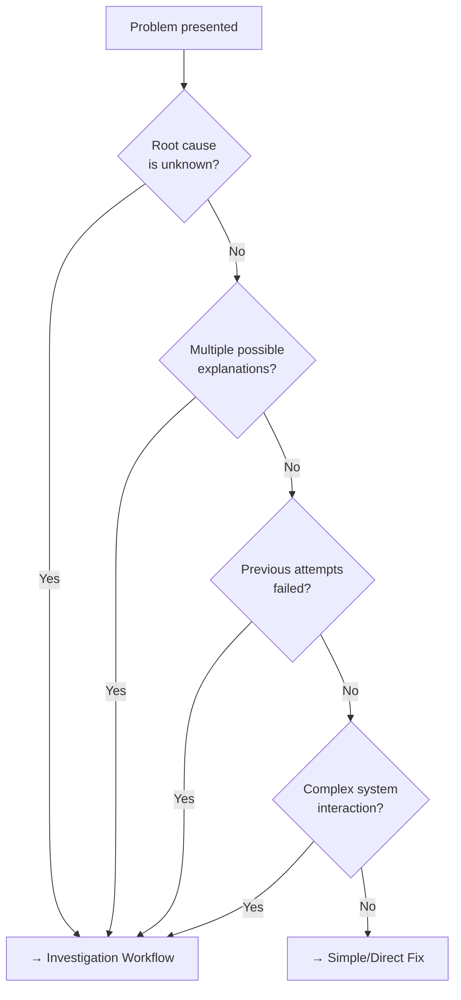

**Investigation Triggers:**

- Debugging unknown errors
- Performance issues
- Intermittent failures
- Unexpected behavior
- Complex refactoring decisions
- Architecture questions

---

## Scientific Method Stages

### Stage 1: Observation

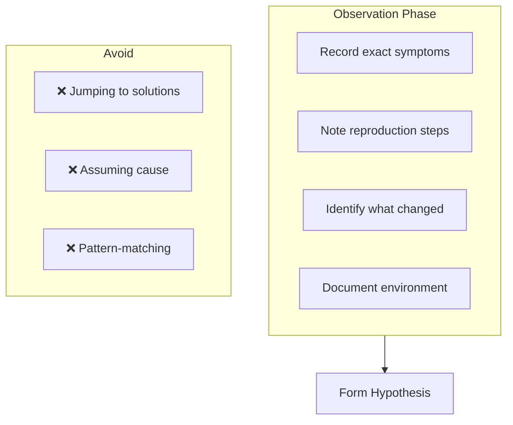

**Observation Checklist:**

- [ ] What exactly is happening?
- [ ] When did it start?
- [ ] What changed recently?
- [ ] Can it be reproduced?
- [ ] What is the exact error/behavior?

---

### Stage 2: Hypothesis Formation

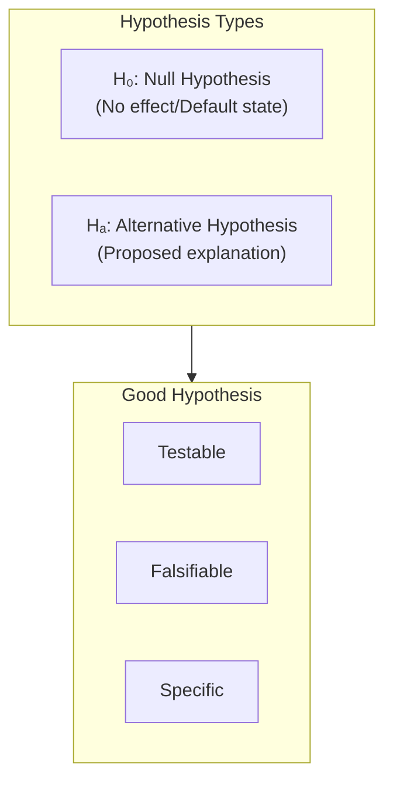

**Format:**

```text
H₀: [Null hypothesis - what we'd expect normally]
Hₐ: [Alternative - our proposed explanation]
```

**Example:**

```text
H₀: The timeout is caused by normal network latency
Hₐ: The timeout is caused by a connection pool exhaustion
```

---

### Stage 3: Prediction

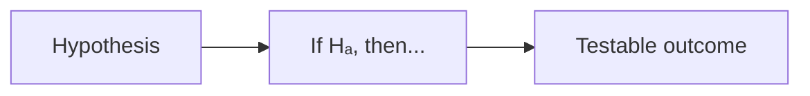

**Prediction Format:**

```text
If Hₐ is true, then [specific, observable outcome]
```

**Example:**

```text
If connection pool exhaustion causes the timeout, then:
- Pool metrics will show 0 available connections
- New connection requests will queue
- Error rate correlates with connection count
```

---

### Stage 4: Experiment

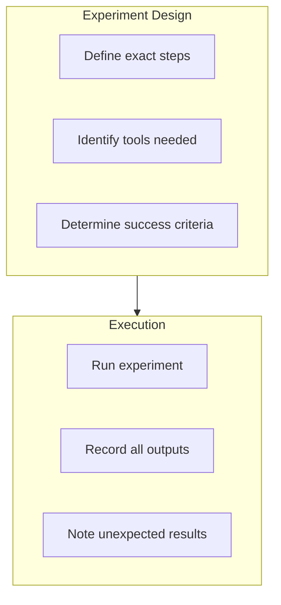

**Tree-of-Thought Planning:**

```text
Experiment:
1. [Action 1] → Expected: [outcome]
2. [Action 2] → Expected: [outcome]
3. [Action 3] → Expected: [outcome]
```

---

### Stage 5: Verification (Chain-of-Verification)

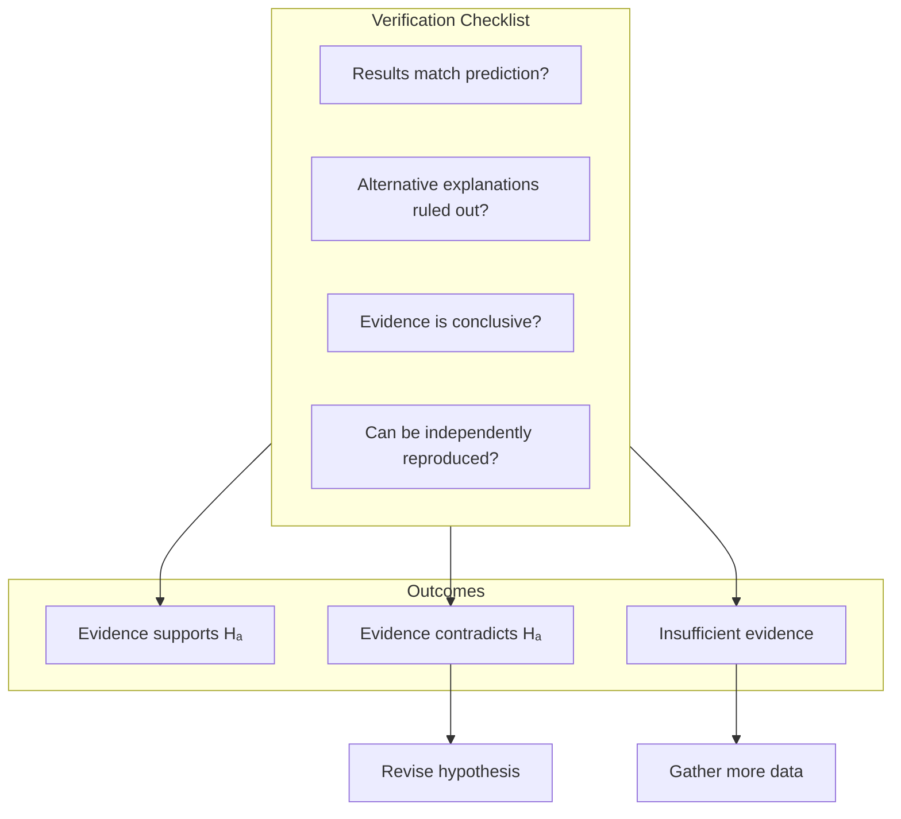

---

### Stage 6: Conclusion

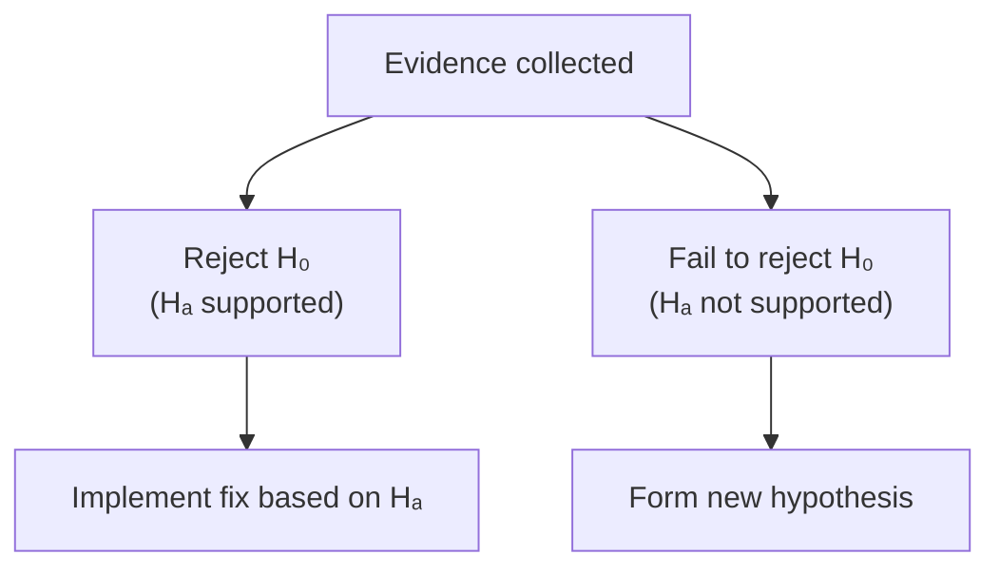

**Conclusion Formats:**

```text
Reject H₀: Evidence shows [specific findings] support Hₐ
Fail to Reject H₀: Evidence shows [specific findings] do not support Hₐ
```

---

## Assets for Investigation

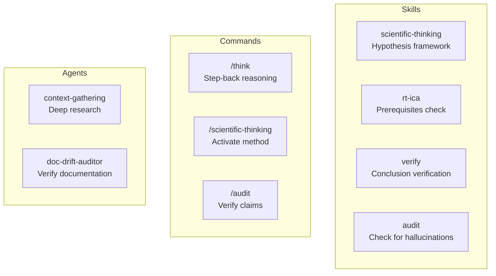

---

## Full Investigation Sequence

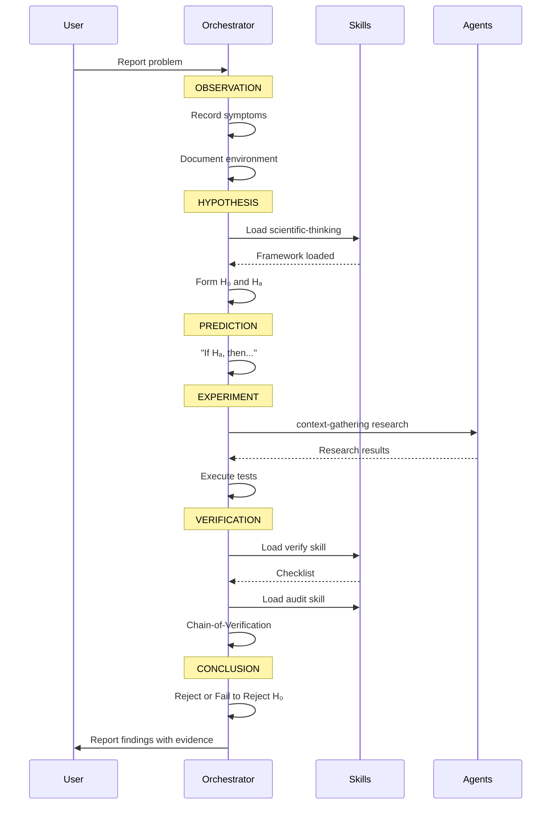

---

## Investigation Template

```text
## Observation
[Exact symptoms, reproduction steps, environment]

## Hypothesis
- H₀: [Null hypothesis]
- Hₐ: [Alternative hypothesis]

## Prediction
If Hₐ, then [specific, observable outcome]

## Experiment (ToT)
1. [Action] → Expected: [outcome]
2. [Action] → Expected: [outcome]
3. [Action] → Expected: [outcome]

## Verification (CoVe)
- [ ] Results match prediction?
- [ ] Alternative explanations ruled out?
- [ ] Evidence conclusive?
- [ ] Reproducible?

## Conclusion
[Reject H₀ / Fail to Reject H₀] based on [specific evidence]
```

---

## Common Anti-Patterns

| Anti-Pattern              | Problem                     | Correct Approach                      |
| ------------------------- | --------------------------- | ------------------------------------- |
| "I know this pattern"     | Bypasses investigation      | Still form and test hypothesis        |
| Solution before diagnosis | May fix wrong thing         | Complete observation first            |
| Single hypothesis         | Confirmation bias           | Consider alternatives                 |
| No verification           | May accept wrong conclusion | Always verify before concluding       |
| Vague predictions         | Can't be tested             | Make specific, observable predictions |

---

## Integration with Full Workflow

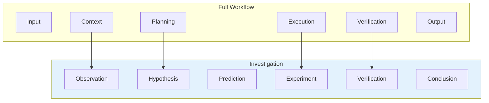

Investigation slots into the full workflow:

- **Context** → Observation (gather facts)
- **Planning** → Hypothesis (form testable theory)
- **Execution** → Experiment (test theory)
- **Verification** → Conclusion (confirm findings)

---

## Navigation

- **Previous:** [Simple Task Workflow](../../../.claude/knowledge/workflow-diagrams/simple-task-workflow.md)
- **Next:** [RAG Retrieval Pattern](../../../.claude/knowledge/workflow-diagrams/rag-retrieval-pattern.md)
- **Back to:** [Index](../../../.claude/knowledge/workflow-diagrams/README.md)
