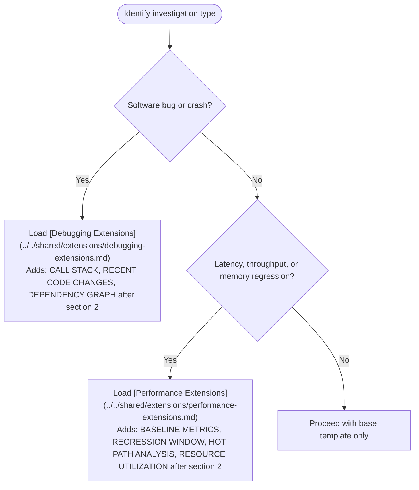
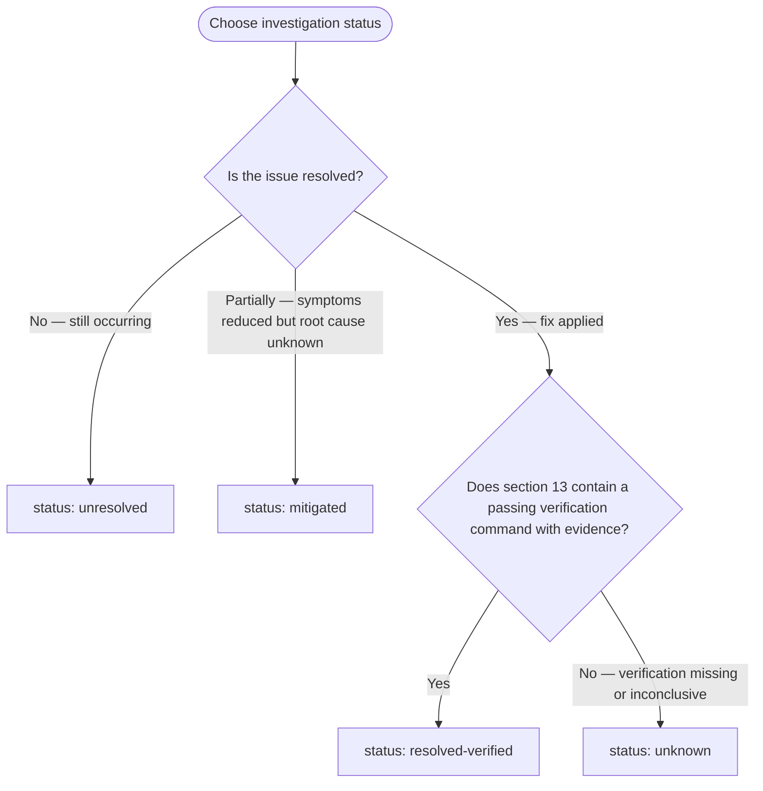

# Evidence-First Debugging

Primary responsibilities: observation recording, evidence IDs, causality validation, verification gates.

## Shared References

Load these references before producing any investigation output. A [references index](./references/shared-references.md) is available for a quick map of all shared files.

- [Unified Investigation Template](../../shared/investigation-template.md) — the 15-section output structure (sections 0–14)
- [Evidence Rules](../../shared/evidence-rules.md) — evidence ID format, truncation disclosure, forbidden phrases
- [Causality Gate](../../shared/causality-check.md) — classification rules for action-result links

## Domain Extensions

Load the applicable extension when the investigation type matches. Insert the extension's sections immediately after section 2 (OBSERVATIONS).



## Non-Negotiable Rules

Enforce these for every investigation output, without exception.

**Rule 1 — Facts only in FACTS / OBSERVATIONS / RESULTS**

Write only directly observed signals. Causal language is permitted only when the Causality Gate classification is `causal-supported`. No guesses, no interpretation, no speculation.

**Rule 2 — Label every hypothesis explicitly**

Every hypothesis must state what it predicts and include a falsifiable test. Use the form:

```text
H1: [specific causal mechanism]
  Prediction: If H1 is true, we would observe [specific outcome]
  Falsification test: [what would disprove H1]
```

**Rule 3 — Reserve `resolved-verified` for verified outcomes**

Output `status: resolved-verified` only when section 13 (Verification) contains a passing verification command with an evidence ID. If section 13 is absent or empty, the status must be `mitigated`, `unresolved`, or `unknown`.

**Rule 4 — Cite evidence IDs on every claim**

Every statement in FACTS or RESULTS must end with an evidence ID in brackets — e.g., `[E3]`. Statements without a citable evidence ID must be labeled `UNKNOWN`.

**Rule 5 — Disclose all truncated output**

When any output is abbreviated, include a truncation disclosure block immediately after the snippet:

```text
TRUNCATED
total lines: <N>
shown: <M>
method: head | tail | grep
fingerprint: <sha256 or key tokens>
command: <exact command used>
```

Silent abbreviation is prohibited.

## Status Options

Choose exactly one per investigation output. Include it in section 14 of the investigation template.



## Output Checklist

Before emitting any investigation output, verify all items.

- [ ] Shared references loaded (investigation template, evidence rules, causality gate)
- [ ] Domain extension loaded if applicable (debugging or performance)
- [ ] All FACTS and RESULTS cite evidence IDs in brackets
- [ ] All hypotheses are labeled explicitly and include falsification tests
- [ ] All truncated output includes a TRUNCATION disclosure block
- [ ] Causality Gate classification present for every action-result link in section 10
- [ ] Status is exactly one of the four valid options
- [ ] `resolved-verified` is used only when section 13 contains passing verification evidence
