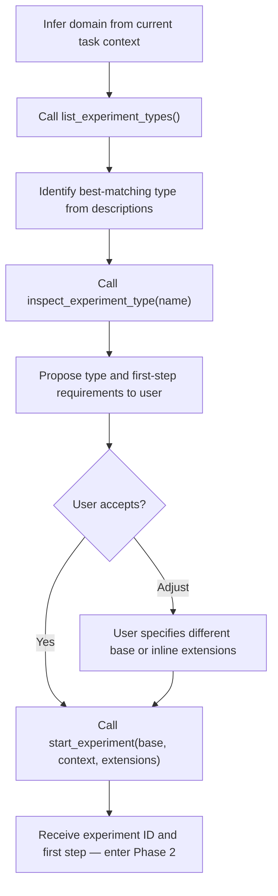
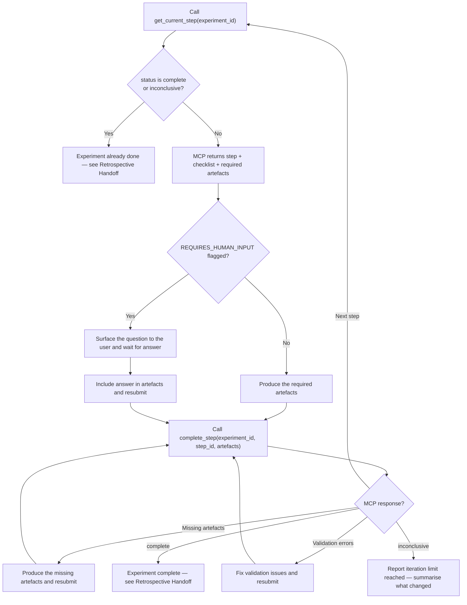

# Experiment Protocol

Drives the experiment-registry MCP server through a controlled experiment lifecycle. The MCP owns
the state machine, validates artefacts, and enforces methodology. This skill is the caller — not
the logic.

## Core Problem

Uncontrolled testing contaminates results. The most common failure mode is embedding success
criteria inside the input the subject under test receives — this measures instruction-following
ability, not the quality of the instructions themselves. A second failure mode is changing
multiple variables between runs, which makes it impossible to attribute any result to any cause.
The third is writing scoring criteria after seeing output, which lets expected results shape the
rubric rather than the other way around.

The experiment-registry MCP server enforces the correct protocol mechanically. Claude's role is
to produce artefacts and submit them — not to manage the workflow.

## Phase 1 — Setup (collaborative)

Work with the user to identify the experiment type before starting the execution loop.

The `extensions` parameter is optional. Pass it when the user specifies additions to the base
type (e.g., extra checklist items or artefacts not in the registry definition).

## Phase 2 — Execution (mechanical, MCP-driven)

No discussion during execution. Step through the MCP workflow autonomously.

The MCP advances state, validates artefact presence, and determines when the experiment is done.
Do not attempt to track or infer step state from memory.

## Read-Only Status

When the user calls `/experiment-protocol status {id}`, call `get_current_step(experiment_id)`
and display the result without calling `complete_step()`. This does not interrupt or advance
the execution loop.

## Anti-Patterns

The MCP enforces these mechanically, but understanding why they are prohibited helps produce
correct artefacts.

**Embedding criteria in the input artefact** — writing expected outcomes or scoring hints inside
the fixture or input the subject receives. This tests instruction-following, not instruction
quality. The rubric and fixture are separate artefacts for this reason.

**Changing multiple things between iterations** — if two things change simultaneously, the result
cannot be attributed to either. The MCP enforces one-change-per-iteration via the iterate step.

**Writing rubric criteria after seeing output** — post-hoc criteria are shaped by what the
subject produced. The MCP requires rubric artefacts before the baseline step runs.

**Reporting only passing runs** — every iteration is recorded. The MCP log captures all runs,
including regressions.

**Changing the control input between iterations** — the task prompt, fixture, and baseline
conditions are frozen after the baseline run. Changing them starts a new experiment.

**Scoring by impression** — every criterion is binary. Call `get_current_step()` to retrieve
the rubric and score each criterion explicitly for each run.

## Retrospective Handoff

When the MCP returns `complete` or `inconclusive` status:

1. Call `get_experiment_summary(experiment_id)` — returns artefact file paths and final status.
2. Pass the file paths to `@retrospective-analyst` for post-experiment analysis.

The analyst reads artefacts directly from disk. No reformatting or summarisation required.
