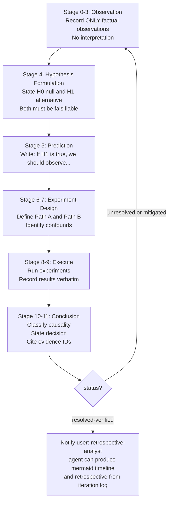

# Scientific Thinking

Enforces the scientific method as an investigation discipline. Governs hypothesis formulation,
predictions, experiment design, and evidence-based conclusions.

## Shared Resources

Load these references at the start of any investigation. A [references index](./references/shared-references.md) is available for a quick map of all shared files.

- [Unified Investigation Template](../../shared/investigation-template.md) — output structure for
  all investigation work
- [Investigation Workflow](../../shared/investigation-workflow.md) — mermaid diagrams of the full
  scientific method flow

## Companion Skill

`evidence-first-debugging` handles observation recording, evidence IDs, and causality
validation. Both skills use the same Unified Investigation Template output structure. Load
`evidence-first-debugging` when the task requires structured evidence tracking alongside
hypothesis work.

## Activation Triggers

Activate this skill when the prompt contains:

- "unknown cause", "strange behavior", "intermittent"
- "architecture decision", "previous attempts failed"
- "root cause", "investigation"

## Scope Boundary

Apply this skill to problems with genuine uncertainty — unknowns, failed attempts, complex
architecture trade-offs.

Tasks outside scope: typo fixes, simple additions, tasks with explicit step-by-step instructions
already provided. For those, execute directly.

## Investigation Stages

Enforce stages in this order. Each stage gates the next.

### Stage Rules

**Observation (sections 0-3):**

- Record only what is directly observable — no causal language, no interpretations
- Each observation requires an evidence ID (delegated to `evidence-first-debugging`)

**Hypothesis Formulation (section 4):**

- H0 (null): the default assumption — no effect, no cause
- H1 (alternative): the proposed cause or mechanism
- Both must be falsifiable — if a hypothesis cannot be tested, rewrite it

**Prediction (section 5):**

- Write one sentence per hypothesis: "If H1 is true, we should observe X when we do Y"
- Predictions must reference observable, measurable outcomes

**Experiment Design (sections 6-7):**

- Path A: test that would confirm H1
- Path B: test that would refute H1 (controls for confounds)
- List confounds explicitly — variables that could produce the same result without H1 being true

**Execute (sections 8-9):**

- Run experiments exactly as designed — record results verbatim, not summarized
- If execution diverges from design, restart from Experiment Design with updated constraints

**Conclusion (sections 10-11):**

- Classify each action-result link: `causal-supported`, `correlated-only`, `unrelated`, or `unknown`
- State the decision derived from evidence
- Every claim must cite an evidence ID — no unsupported assertions
