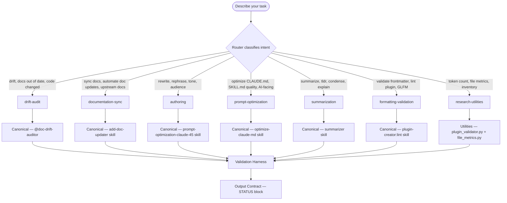

# The Rewrite Room

This plugin is a workflow router for documentation and authoring tasks. It is NOT a writing tool itself. It selects the correct canonical workflow, delegates to the appropriate agent or skill, runs the validation harness, and enforces the output contract.

**What this plugin is**: A routing layer that maps task intent to canonical components.

**What this plugin is not**: A replacement for the canonical agents and skills it routes to. Do not use this skill to bypass the canonical workflows — route through them.

**Do not select a workflow manually** — describe your task and the router selects.

## Quick-Start Routing Examples

```text
"The README is out of sync with the code after last week's refactor"
→ drift-audit workflow → @doc-drift-auditor agent → evidence-based report

"Rewrite this CLAUDE.md — it uses too many prohibitions and reads poorly for AI"
→ prompt-optimization workflow → @contextual-ai-documentation-optimizer → before/after diff

"Summarize this 3000-line architecture document for the team"
→ summarization workflow → summarizer skill (file strategy) → structured summary with fidelity check
```

## Workflow Taxonomy



## Workflow Registry

See [./registry/workflows.yaml](./registry/workflows.yaml) for the full machine-readable workflow registry.

See [./references/registry-guide.md](./references/registry-guide.md) for instructions on adding new workflows, validators, and adapters.

## Output Contract — STATUS Block

Every workflow execution MUST terminate with a STATUS block:

```text
STATUS: DONE|BLOCKED|FAILED
SUMMARY: [1-2 sentences, factual, no speculation]
ARTIFACTS:
  - path/to/output-file.md
VALIDATION:
  - validator-name: PASS|FAIL
  - validator-name: PASS|FAIL
NOTES: [only if needed — issues, caveats, follow-up tasks]
```

`BLOCKED` — workflow cannot proceed; user action required. State the blocker in NOTES.

`FAILED` — validation gate returned non-zero; artifact produced but failed quality check.

`DONE` — all validators PASS; artifact meets output contract.

## Adapter Shims for Legacy Components

The following adapters normalize legacy component output to the STATUS block contract:

- [./workflows/adapters/add-doc-updater-adapter.md](./workflows/adapters/add-doc-updater-adapter.md)
- [./workflows/adapters/doc-drift-auditor-adapter.md](./workflows/adapters/doc-drift-auditor-adapter.md)
- [./workflows/adapters/contextual-ai-documentation-optimizer-adapter.md](./workflows/adapters/contextual-ai-documentation-optimizer-adapter.md)
- [./workflows/adapters/summarizer-adapter.md](./workflows/adapters/summarizer-adapter.md)

## Workflow Reference Files

- [./workflows/drift-audit.md](./workflows/drift-audit.md)
- [./workflows/documentation-sync.md](./workflows/documentation-sync.md)
- [./workflows/authoring.md](./workflows/authoring.md)
- [./workflows/prompt-optimization.md](./workflows/prompt-optimization.md)
- [./workflows/summarization.md](./workflows/summarization.md)
- [./workflows/formatting-validation.md](./workflows/formatting-validation.md)
- [./workflows/research-utilities.md](./workflows/research-utilities.md)

## Routing Scripts

```bash
# Classify a task description
uv run plugins/the-rewrite-room/skills/the-rewrite-room/scripts/router.py classify "docs are out of date after the refactor"

# List all registered workflows
uv run plugins/the-rewrite-room/skills/the-rewrite-room/scripts/router.py list

# Check markdown links in a file
uv run plugins/the-rewrite-room/skills/the-rewrite-room/scripts/link_checker.py check path/to/file.md

# Measure file token estimates
uv run plugins/the-rewrite-room/skills/the-rewrite-room/scripts/file_metrics.py scan plugins/the-rewrite-room/
```
