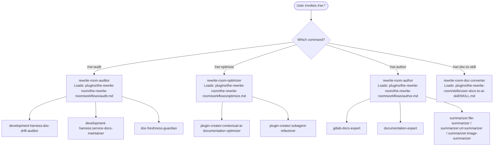
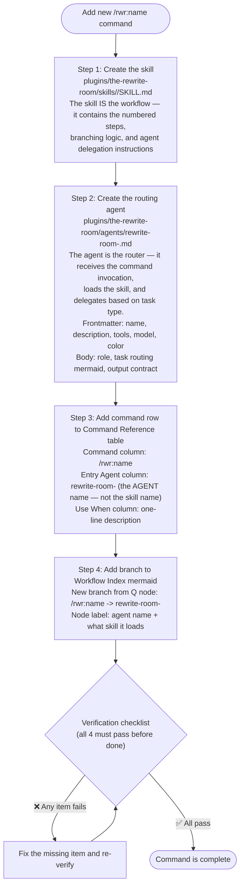

# The Rewrite Room

Routes documentation, authoring, and optimization tasks to the correct specialist agents. Does not rewrite source agents or skills — orchestrates them. Governs authoring, docs, prompts, and summaries — not product code.

## Quick Start

```text
/rwr:audit "check if kaizen plugin docs match the code"
/rwr:optimize "plugins/plugin-creator/skills/add-doc-updater/SKILL.md"
/rwr:author "summarize plugins/summarizer/skills/summarizer/SKILL.md"
```

## Command Reference

| Command | Entry Agent | Use When |
|---------|-------------|----------|
| `/rwr:audit <task>` | rewrite-room-auditor | Docs vs code drift, doc sync after changes, freshness tracking |
| `/rwr:optimize <file>` | rewrite-room-optimizer | CLAUDE.md, SKILL.md, agent .md improvement |
| `/rwr:author <task>` | rewrite-room-author | User-facing docs, GLFM validation, summarization |
| `/rwr:doc-to-skill <docs_path> <output_plugin> <output_skill>` | rewrite-room-doc-converter | Convert user-facing docs directory into a Claude Code skill |

Each command loads the corresponding workflow file and follows its numbered steps.

## Workflow Index



## Workflow Files

Each command agent loads the corresponding workflow file at runtime:

- Audit workflow: `plugins/the-rewrite-room/the-rewrite-room/workflows/audit.md`
- Optimize workflow: `plugins/the-rewrite-room/the-rewrite-room/workflows/optimize.md`
- Author workflow: `plugins/the-rewrite-room/the-rewrite-room/workflows/author.md`

Workflow files contain numbered steps, conditional branching, explicit agent spawn instructions, structured return handling, and output contracts.

## Adding New Workflows

Every rwr command requires four components. All four are mandatory — there are no exceptions. A command that exists in the table without a routing agent cannot be invoked.



**Verification checklist — all four required before the command is declared complete:**

- [ ] Agent file exists at `plugins/the-rewrite-room/agents/rewrite-room-<name>.md`
- [ ] Agent registered in `.claude-plugin/plugin.json` agents array as `"./agents/rewrite-room-<name>.md"`
- [ ] Command row in Command Reference table — Entry Agent column contains the agent name (not the skill name)
- [ ] Branch in Workflow Index mermaid points to the agent node (not the skill directory)

**Skill vs agent — the distinction that prevents the missing-agent failure:**

- The **skill** (`skills/<name>/SKILL.md`) contains the workflow: numbered steps, conditional logic, specialist agent delegation
- The **routing agent** (`agents/rewrite-room-<name>.md`) is the entry point: it receives the `/rwr:name` invocation, loads the skill, and executes it
- A skill alone cannot receive a command invocation — it must be loaded by an agent
- `user-docs-to-ai-skill` is a skill name, not an agent name — it cannot appear in the Entry Agent column

## Source Components

This plugin routes to these specialist agents and scripts (not copied — referenced by path):

**Audit agents:**

- `plugins/development-harness/agents/doc-drift-auditor.md` — evidence-based drift audit with file:line citations
- `plugins/development-harness/agents/service-docs-maintainer.md` — post-implementation doc sync via git diff
- `/home/ubuntulinuxqa2/.claude/agents/doc-freshness-guardian.md` — freshness headers and staleness alerts

**Optimize agents:**

- `plugins/plugin-creator/agents/contextual-ai-documentation-optimizer.md` — RT-ICA + CoVe prompt optimization with token impact reporting
- `plugins/plugin-creator/agents/subagent-refactorer.md` — Anthropic official best practices refactoring with mandatory research phase

**Author agents:**

- `gitlab-docs-expert` — GitLab Wiki, MR descriptions, GitLab README authoring
- `documentation-expert` — general README, tutorials, API docs, user-facing docs

**Summarizer agents:**

- `plugins/summarizer/agents/file-summarizer.md` — file content summarization with fidelity enforcement
- `plugins/summarizer/agents/url-summarizer.md` — URL content summarization
- `plugins/summarizer/agents/image-summarizer.md` — image/screenshot description

**Validation scripts:**

- `plugins/gitlab-skill/skills/gitlab-skill/scripts/validate_glfm.py` — GitLab Flavored Markdown validation via GitLab API
- `plugins/plugin-creator/scripts/validate_frontmatter.py` — YAML frontmatter schema validation

**Reference files consulted by workflows:**

- `plugins/summarizer/skills/summarizer/references/fidelity-rules.md` — summarizer fidelity rules
- `plugins/gitlab-skill/skills/gitlab-skill/references/glfm-syntax.md` — GLFM syntax reference
- `plugins/prompt-optimization-claude-45/skills/prompt-optimization-claude-45/SKILL.md` — prompt optimization principles
