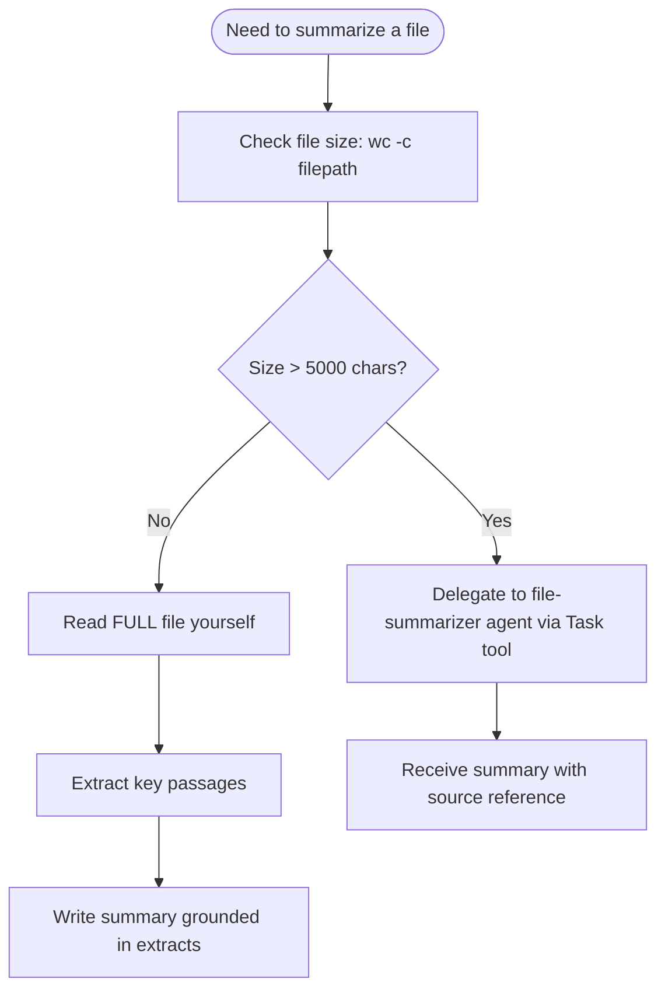

# Fidelity Rules

These rules apply to ALL summarization operations routed through the-rewrite-room. They consolidate the rules from the summarizer plugin and the global CLAUDE.md summarization rules.

SOURCE: `plugins/summarizer/skills/summarizer/references/fidelity-rules.md` (verified 2026-02-20)

SOURCE: Global CLAUDE.md Summarization Rules section (verified 2026-02-20)

## Three Failure Modes These Rules Prevent

1. **Hallucinated content** — guessing file contents from filename instead of reading
2. **Lossy summary chains** — summarizing a summary, losing nuance at each step
3. **Speculation as observation** — upgrading "not found" to "doesn't exist"

## Rule 1 — Read Before Summarizing

The model MUST read the actual content of any source before producing a summary.

Prohibited:

- Guessing file contents from filename or path
- Describing a file based on its position in a directory listing
- Summarizing a URL from its domain or path segments
- Inferring image content from the filename

Required:

- Use Read tool to read files
- Use `mcp__Ref__ref_read_url` to read URLs
- Use Read tool to view images (Claude Code is multimodal)
- If source cannot be read: state "Unable to read [source]: [reason]"

Decision gate for file size:



## Rule 2 — Extract Before Abstracting

When summarizing text content, MUST first extract relevant quotes or passages, then summarize from those extracts.

Process:

1. Read full source
2. Identify and extract key passages (extractive step)
3. Organize extracts by theme or importance
4. Write summary grounded in the extracts (abstractive step)
5. Verify every claim in the summary traces back to an extract

Why: Extraction creates an audit trail. A summary claim that cannot be traced to an extracted passage may be hallucinated.

SOURCE: "Ground responses in quotes" technique — Anthropic prompt engineering documentation (<https://docs.anthropic.com/en/docs/build-with-claude/prompt-engineering/long-context-tips>, accessed 2026-02-06)

## Rule 3 — Preserve Counts and Specifics

When relaying quantitative information, MUST preserve exact numbers, counts, and specifics.

Prohibited transformations:

- "7 items found, 3 not accessible" → "Most items found"
- "Error on lines 45, 89, 203" → "Several errors found"
- "3 of 10 tests failed" → "Some tests failed"
- "Response time: 245ms" → "Fast response time"

Required: Preserve the original numbers. If compression needed, state numbers then add interpretation.

## Rule 4 — Distinguish Absence from Nonexistence

MUST use precise language when information is not found.

| Situation | Correct Language | Incorrect Language |
|---|---|---|
| Searched but not in source | "Not mentioned in this document" | "Doesn't exist" |
| Source inaccessible | "Unable to access [source]" | "Not available" |
| Source doesn't cover topic | "Outside the scope of this source" | "Not supported" |
| Contradictory sources | "Source A says X, Source B says Y" | "The answer is X" |

Reporting what you searched and what you found is an observation. Concluding something does not exist is a claim that requires evidence beyond "I didn't find it."

## Rule 5 — No Lossy Re-Summarization

When an orchestrator receives a summary from a sub-agent, it MUST NOT re-summarize that summary.

Prohibited (lossy chain):

```text
Agent: "7 items found with details, 3 items inaccessible"
Orchestrator: "Research complete, 7 items found, the rest don't exist"
                                                  ^^^ INFORMATION CORRUPTED
```

Required (relay):

```text
Agent: "7 items found, 3 inaccessible" — writes results to ./research-results.md
Orchestrator: "Research complete. 7 items found, 3 inaccessible. Full results: ./research-results.md"
```

Rules for orchestrators:

1. If agent wrote a file, reference the file path
2. If agent returned counts, preserve exact counts
3. If agent reported failures, preserve failure reasons
4. Do NOT interpret agent results — relay them
5. Do NOT upgrade "inaccessible" to "nonexistent"

## Rule 6 — State Confidence Explicitly

Every summary MUST include a confidence assessment.

Factors that reduce confidence:

- Source was partially read (truncated, paginated, rate-limited)
- Source is dated (information may have changed)
- Source is informal (chat message vs. official documentation)
- Summarizer had to interpret (not just extract)

Factors that increase confidence:

- Full source was read completely
- Source is authoritative (official documentation, primary source)
- Source is recent and dated
- Content is factual/structured (API spec, config file) vs. opinion/narrative

## Rule 7 — Structured Output Always

Every summary MUST use the structured output format defined in the summarizer skill's templates.

Required sections: Summary, What Was Found, What Was NOT Found, Uncertain, Sources

If nothing belongs in a section, write "None" or "N/A" — do not omit the section.

This prevents uncertain information from being silently mixed into the summary as if it were definitive.

## Fidelity Validator Trigger Phrases

The fidelity-enforcer validator (prompt-hook type) rejects summaries containing these patterns:

- Vague quantifiers where count was available: "many", "several", "some", "a few", "most"
- Causal speculation: "likely", "probably", "I think", "presumably"
- Absence-as-nonexistence: "doesn't exist", "not available", "not supported" (without evidence)
- Missing sections: if any of the 5 required sections is absent
- Missing confidence field in YAML frontmatter
