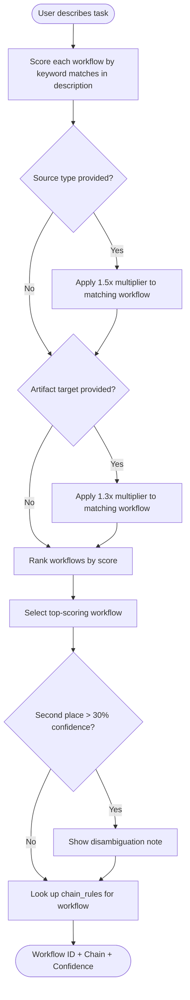

# Registry Guide

The registry is the machine-readable source of truth for all workflows, validators, and routing rules in the-rewrite-room plugin. The router script reads from it; documentation generates from it.

## What the Registry Contains

Three YAML files:

- [./workflows.yaml](./workflows.yaml) — canonical workflow definitions (7 workflows)
- [./validators.yaml](./validators.yaml) — validator definitions with invocation patterns
- [./routing-rules.yaml](./routing-rules.yaml) — keyword signals, source/artifact signals, chain rules, disambiguation rules

## How Routing Decisions Are Made



## How to Add a New Workflow

1. Add an entry to [./workflows.yaml](./workflows.yaml):

```yaml
- id: my-new-workflow
  name: "My New Workflow"
  description: "What this workflow does"
  canonical_skill: skill-name
  canonical_path: "plugins/skill-plugin/skills/skill-name/SKILL.md"
  triggers:
    - "keyword one"
    - "keyword two"
  source_types: [file, url]
  artifact_targets: [README.md, "docs/"]
  validators:
    - link-checker
  output_contract: status-block-v1
  chain_next: [formatting-validation]
  dependencies:
    scripts: []
    references: ["./references/output-contracts.md"]
```

2. Add intent signals to [./routing-rules.yaml](./routing-rules.yaml) under `intent_signals`:

```yaml
my-new-workflow:
  keywords:
    - "keyword one"
    - "keyword two"
  source_signals: [file]
  artifact_signals: [README.md]
```

3. Add chain rule if the workflow chains to others:

```yaml
chain_rules:
  - pattern: "my-new-workflow"
    chain: [my-new-workflow, formatting-validation]
    condition: "always"
```

4. Create a workflow spec file at `./workflows/my-new-workflow.md` following the pattern of existing workflow files.

5. Test routing: `uv run scripts/router.py classify "keyword one for my workflow"`

## How to Add a New Validator

Add an entry to [./validators.yaml](./validators.yaml):

```yaml
- id: my-validator
  name: "My Validator"
  script: "plugins/my-plugin/scripts/my_validator.py"
  invocation: "uv run {script} {target}"
  requires_env: []
  applies_to: [SKILL.md, README.md]
  hard_stop: true
```

- `hard_stop: true` — validation failure blocks the workflow from completing
- `hard_stop: false` — validation failure is flagged but does not block

Reference the validator ID in the `validators` list of any workflow entry that should use it.

## How to Add an Adapter for a Legacy Agent or Skill

1. Create an adapter spec at `./workflows/adapters/{component-name}-adapter.md`
2. Document: which component it wraps, native output contract, adapter transformation, validators added
3. Reference the adapter in the workflow spec file (`## Adapter Notes` section)

See [../workflows/adapters/doc-drift-auditor-adapter.md](../workflows/adapters/doc-drift-auditor-adapter.md) for a complete example.

## How to Test After Adding

```bash
# Verify the new workflow appears in the list
uv run plugins/the-rewrite-room/skills/the-rewrite-room/scripts/router.py list

# Classify a task that should trigger the new workflow
uv run plugins/the-rewrite-room/skills/the-rewrite-room/scripts/router.py classify "keyword one for my workflow"

# Verify link-checker passes on all registry files
uv run plugins/the-rewrite-room/skills/the-rewrite-room/scripts/link_checker.py check-dir plugins/the-rewrite-room/skills/the-rewrite-room/registry/
```

## Version History

- 1.0 — Initial registry with 7 canonical workflows
