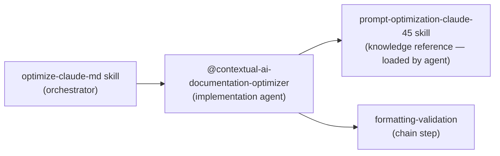

# Prompt Optimization Workflow

## Purpose

AI-facing documentation optimization — CLAUDE.md files, SKILL.md files, and agent definitions. Full orchestration with baseline token measurement, delegation to @contextual-ai-documentation-optimizer, independent CoVe verification, and before/after reporting.

This workflow is for AI-FACING content. For human-facing content (README, user docs), route to authoring instead.

## Entrypoint Contract

### Required Inputs

- Target file path — CLAUDE.md, SKILL.md, or agent .md file
- Scope — single file, skill directory, or plugin directory

### Optional Inputs

- Specific optimization goal (reduce token count, convert prohibitions, add examples, add mermaid diagrams)

## Steps

1. **Activate optimize-claude-md skill** — `Skill(command: "optimize-claude-md")`
2. **Measure baseline** — token count, section inventory, prohibition patterns
3. **RT-ICA pre-check** — verify all required inputs are available before optimization begins
4. **Delegate to @contextual-ai-documentation-optimizer** — provide file path and optimization goals; do NOT pre-summarize content
5. **Agent runs 6-step process** — RT-ICA → analyze → diagnose → apply → compare → CoVe post-check → structural upgrade analysis
6. **Independent verification** — verify agent output against original
7. **Before/after report** — token delta, structural changes, prohibition conversions
8. **Chain to formatting-validation** — run frontmatter-validator on result

## Validation Gates

- HARD STOP — frontmatter `description` contains colon outside of URL: fix before committing
- HARD STOP — `allowed-tools` is a YAML array (not comma-separated string): fix before committing
- SOFT STOP — token count increased: flag in report, let user decide
- SOFT STOP — prohibition pattern not converted: flag with suggested alternative

## Output Contract

```text
STATUS: DONE|BLOCKED|FAILED
SUMMARY: [what was optimized, key structural changes]
ARTIFACTS:
  - path/to/optimized-file.md
VALIDATION:
  - frontmatter-validator: PASS|FAIL
  - prompt-structure-validator: PASS|FAIL
DIFF:
  tokens_before: N
  tokens_after: N
  delta: +N / -N
  prohibitions_converted: N
NOTES: [only if needed]
```

See [../references/output-contracts.md](../references/output-contracts.md) for the full optimization-block-v1 specification.

## Delegation Chain



The `prompt-optimization-claude-45` skill is a knowledge reference, not an executable workflow. It is loaded internally by the `@contextual-ai-documentation-optimizer` agent. Do not invoke it directly.
