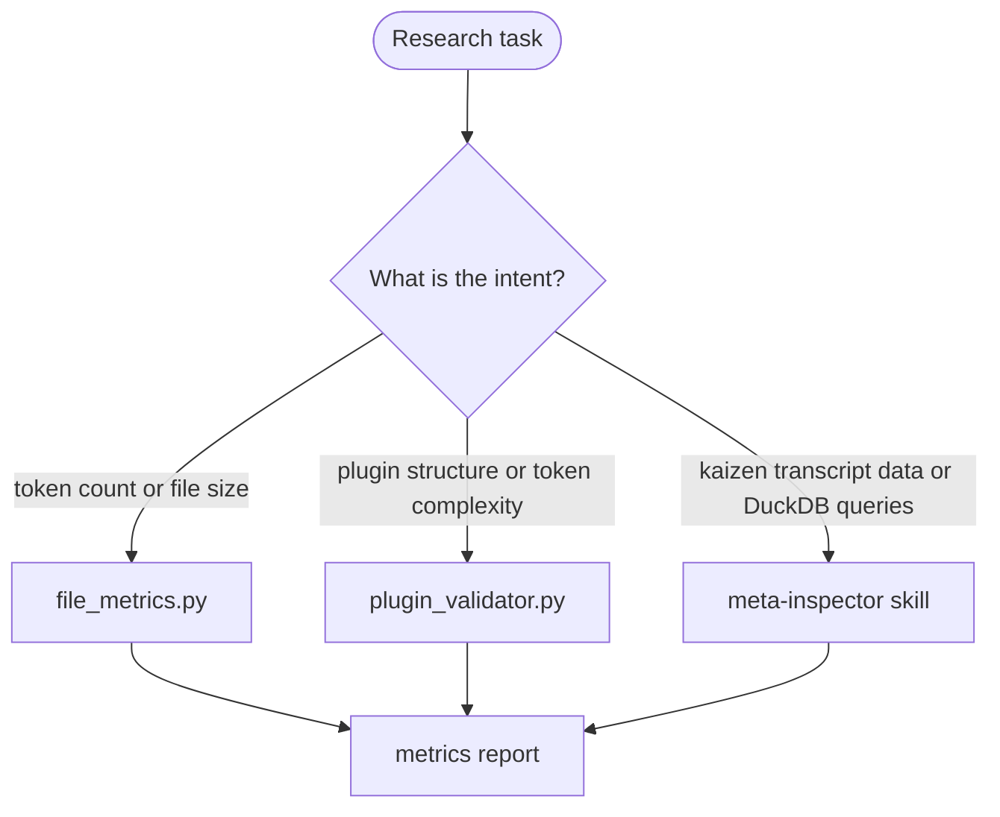

# Research Utilities Workflow

## Purpose

Token counting, file metrics, component discovery, and data extraction. No canonical single agent — routes to the appropriate utility based on the research intent.

## Routing Within Research Utilities



## Tools by Task

### Token Count and File Metrics

```bash
# Count tokens in a single file
uv run plugins/the-rewrite-room/skills/the-rewrite-room/scripts/file_metrics.py count path/to/file.md

# Scan all .md files in a directory
uv run plugins/the-rewrite-room/skills/the-rewrite-room/scripts/file_metrics.py scan plugins/the-rewrite-room/
```

### Plugin Structure and Token Complexity

```bash
# Validate and report token complexity
uv run plugins/plugin-creator/scripts/plugin_validator.py plugins/my-plugin/ --verbose
```

### Kaizen Transcript Data Extraction

Activate the meta-inspector skill for DuckDB queries against session transcripts:

```text
Skill(command: "agentskill-kaizen:meta-inspector")
```

## Entrypoint Contract

### Required Inputs

- Source — file path or directory to analyze
- Intent — one of: token-count, file-metrics, plugin-inventory, transcript-extraction

### Optional Inputs

- `--json` flag — for machine-readable output from file_metrics.py
- DuckDB query — for meta-inspector transcript extraction

## Output Contract

```text
STATUS: DONE|BLOCKED|FAILED
SUMMARY: [what was measured, key findings]
ARTIFACTS:
  - (metrics output is console/inline — no artifact file unless --json used)
VALIDATION: []
NOTES: [only if needed]
```

## Scope Boundaries

This workflow does NOT perform analysis or recommendations — it returns raw measurements. If you need to interpret the measurements (e.g., decide if a skill should be split), route to drift-audit or formatting-validation instead.
