# User Docs to AI Skill

Converts human-readable documentation into a Claude Code skill directory. The output is consumed by Claude, not humans — every word must serve AI comprehension, not user readability.

## Inputs

- `$1` (`docs_path`) — GitHub URL (e.g. `https://github.com/astral-sh/ty`) or local directory path containing documentation
- `$2` (`output_plugin`) — name for the output plugin (e.g., `ty-skill`)
- `$3` (`output_skill`) — (optional) name for the skill within the plugin; derived from project name when not provided

## Output Contract

Creates `plugins/$2/skills/$3/` containing:

- `SKILL.md` — valid frontmatter + AI-facing workflow instructions + links to all reference files
- `references/` — thematically grouped knowledge files, each linked from SKILL.md

## Workflow

```mermaid
flowchart TD
    Start([Skill receives source + output_plugin]) --> Phase0[Phase 0 — Input Resolution]
    Phase0 --> Q_src{source type?}
    Q_src -->|GitHub URL| Clone["git clone source .claude/worktrees/project-name/\nproject-name = last URL segment"]
    Q_src -->|Local path| UseLocal[Use path as-is]
    Clone --> SetRoot[Set docs_root = .claude/worktrees/project-name/]
    UseLocal --> SetRoot
    SetRoot --> Q_name{output_skill provided?}
    Q_name -->|No| DeriveName[Derive output_skill from project-name]
    Q_name -->|Yes| FindDocs
    DeriveName --> FindDocs[Locate documentation within docs_root]
    FindDocs --> Q_docs{docs/ directory exists?}
    Q_docs -->|Yes| UseDocs[Set docs_path = docs_root/docs/]
    Q_docs -->|No| ScanAll["Task: Explore agent\nGlob all .md files across docs_root\nReturn list of markdown and inline doc files"]
    UseDocs --> Inv
    ScanAll --> Inv[Glob all files in docs_path\nCount by type .md .html .rst .txt\nIdentify top-level sections and index files]
    Inv --> Phase1[Phase 1 — Extraction]
    Phase1 --> Extract[Apply extraction patterns per doc type\nSee extraction-patterns.md]
    Extract --> Phase15[Phase 1.5 — Workflow Identification]
    Phase15 --> WfDetect[Scan atoms for TYPE: pattern and TYPE: constraint atoms<br>that describe multi-step sequences or decision trees]
    WfDetect --> Q0{Any workflow-shaped atoms found?}
    Q0 -->|No| Classify
    Q0 -->|Yes — delegate each to process-siren| WfDelegate["Task: subagent_type='process-siren:process-siren'<br>Output: resources/workflows/{slug}.md"]
    WfDelegate --> Classify[Classify remaining atoms into themes\nEach theme becomes one reference file]
    Classify --> Phase2[Phase 2 — Structure]
    Phase2 --> Scaffold[Scaffold output directory\nplugins/$2/skills/$3/]
    Scaffold --> Write[Phase 3 — Write]
    Write --> RefFiles[Write references/*.md files\nOne file per theme — see skill-structure-guide.md]
    RefFiles --> SkillMD[Write SKILL.md\nFrontmatter + workflow + links to all reference files]
    SkillMD --> Phase4[Phase 4 — Verify]
    Phase4 --> QC[Apply quality-criteria.md checklist\nFix any failing criteria]
    QC --> Q2{All criteria pass?}
    Q2 -->|No| Fix[Fix failing items — re-run checklist]
    Fix --> Q2
    Q2 -->|Yes| Done([Done — report output path and file inventory])
```



## Phase 0 — Input Resolution and Inventory

Run before any extraction. Do not skip.

See [input-resolution.md](./references/input-resolution.md) for complete branching logic. Summary:

### Step 0a — Resolve source to a local directory

1. If `source` matches `https://github.com/*` — it is a GitHub URL:
   - Derive `project-name` from the last path segment (e.g. `astral-sh/ty` → `ty`)
   - Run `git clone <source> .claude/worktrees/<project-name>/` (path relative to project root)
   - Set `docs_root = .claude/worktrees/<project-name>/`
2. Otherwise — treat `source` as a local directory path and set `docs_root = source`

### Step 0b — Derive output_skill if not provided

If `output_skill` was not passed as input, derive it from `project-name` (the last URL segment or last path segment of the local path).

### Step 0c — Locate documentation within docs_root

1. Check whether `docs_root/docs/` exists
2. If yes — set `docs_path = docs_root/docs/` and proceed
3. If no — delegate to an Explore subagent: `Glob("**/*.md", docs_root)` plus check for inline docstrings; collect all markdown file paths; set `docs_path` to the list of discovered files

### Step 0d — Inventory

1. `Glob("**/*", docs_path)` — list all files
2. Group by extension: `.md`, `.html`, `.rst`, `.txt`, other
3. Read the index file (`index.md`, `README.md`, `index.html`, or equivalent) to understand top-level structure
4. List all section headings from the index — these hint at reference file themes
5. Note total file count and estimated reading volume

Report the inventory before proceeding to Phase 1.

## Phase 1 — Extraction

Apply extraction patterns from [extraction-patterns.md](./references/extraction-patterns.md).

Extraction produces a structured list of knowledge atoms:

```text
ATOM: <one-sentence fact, constraint, parameter, or pattern>
TYPE: <command | parameter | constraint | pattern | error | example>
SOURCE: <filename:section>
```

Collect atoms into a flat list first. Do not group yet — grouping happens in Phase 2.

## Phase 1.5 — Workflow Identification

Runs after Phase 1 extraction, before Phase 2 grouping. Identifies workflow-shaped atoms and converts them to validated Mermaid diagrams via `process-siren`.

See [workflow-identification.md](./references/workflow-identification.md) for detection criteria, delegation prompt construction, and blocking-condition responses.

### Identify Workflow-Shaped Atoms

Scan the flat atom list produced in Phase 1. An atom is workflow-shaped when it meets any of:

- Describes a multi-step sequence with order-dependent steps
- Contains decision conditions with observable branch outcomes
- Involves multiple actors or system states with explicit transitions
- Has a defined terminal outcome (success, failure, or completion state)

Simple sequential prose ("first do X, then do Y") without branching is NOT workflow-shaped — leave it as atoms for thematic grouping.

### Delegate Each Workflow to process-siren

For each identified workflow-shaped atom cluster, delegate via Agent tool:

```text
Task: subagent_type="process-siren:process-siren"
Context to include in the prompt:
  - The raw prose or atom text verbatim
  - What the workflow represents (1 sentence of context)
  - Output file path: plugins/$2/skills/$3/resources/workflows/{slug}.md
Output: resources/workflows/{slug}.md — validated Mermaid flowchart file
```

Derive `{slug}` from the workflow topic (e.g., `installation-flow`, `error-recovery`, `auth-decision`).

### When process-siren Blocks

process-siren blocks when it detects undefined actors, vague conditions, or missing terminal states. Respond by:

1. Returning to the source docs for the specific missing element
2. Extracting the clarifying detail and re-delegating with updated prose
3. If the source docs do not resolve the gap — write a stub file at the output path containing `<!-- TODO: manual-workflow-needed — [describe the gap] -->` and continue

### Reference Workflow Files from SKILL.md

After all workflow files are written, add a `## Workflows` section to the output SKILL.md listing each file:

```text
## Workflows

- [Workflow Name](./resources/workflows/slug.md)
```

## Phase 2 — Thematic Grouping

Group atoms into themes. Each theme becomes one reference file.

Rules:

- A theme is a coherent knowledge domain (e.g., "configuration options", "error messages", "CLI commands")
- Maximum 6 themes. If more exist, merge related ones.
- Minimum 3 atoms per theme. If fewer, merge into an adjacent theme.
- Theme names map directly to reference filenames — see [skill-structure-guide.md](./references/skill-structure-guide.md)

## Phase 3 — Write Reference Files

For each theme, write `references/{theme-slug}.md`.

Follow the format rules in [skill-structure-guide.md](./references/skill-structure-guide.md).

Write all reference files before writing SKILL.md.

## Phase 4 — Write SKILL.md

After all reference files exist:

1. Write frontmatter — see frontmatter rules in [skill-structure-guide.md](./references/skill-structure-guide.md)
2. Write workflow section as a Mermaid flowchart covering the primary task types the skill handles
3. Write one section per reference file linking to it with `[text](./references/filename.md)`
4. Confirm every reference file is linked from SKILL.md

## Phase 5 — Quality Verification

Apply the checklist in [quality-criteria.md](./references/quality-criteria.md) before declaring done.

If any item fails, fix it and re-run the checklist. Do not declare done with failing criteria.

## Reference Files

- [input-resolution.md](./references/input-resolution.md) — resolving GitHub URLs and local paths to a local directory, deriving output_skill, and locating docs within the resolved root
- [extraction-patterns.md](./references/extraction-patterns.md) — how to extract AI-usable knowledge from each doc type
- [workflow-identification.md](./references/workflow-identification.md) — detecting workflow-shaped content, constructing process-siren delegation prompts, and responding to blocking conditions
- [skill-structure-guide.md](./references/skill-structure-guide.md) — output skill directory structure, frontmatter rules, reference file format
- [quality-criteria.md](./references/quality-criteria.md) — measurable criteria and common failure modes
