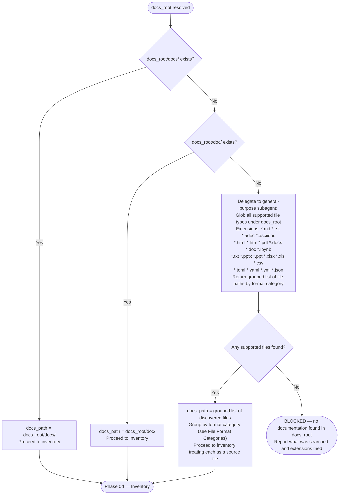

# Input Resolution and Docs Discovery

Covers Phase 0 of `user-docs-to-ai-skill` — resolving the `source` input to a local directory, deriving `output_skill` when not provided, and locating documentation within the resolved directory.

## Table of Contents

1. [Source Type Resolution](#source-type-resolution)
2. [Project Name Derivation](#project-name-derivation)
3. [output_skill Derivation](#output_skill-derivation)
4. [Docs Discovery](#docs-discovery)
5. [File Format Categories](#file-format-categories)
6. [Anti-Patterns](#anti-patterns)

---

## Source Type Resolution


### Git Clone Command

```bash
git clone <source> .clone/worktrees/<project-name>/
```

- Path is relative to the project root — do not use absolute paths
- `project-name` is derived from the URL before cloning (see next section)
- If `.clone/worktrees/<project-name>/` already exists, skip the clone and use the existing directory

---

## Project Name Derivation

Extract `project-name` from the last non-empty path segment of the input.

| Input | project-name |
|-------|-------------|
| `https://github.com/astral-sh/ty` | `ty` |
| `https://github.com/anthropics/anthropic-sdk-python` | `anthropic-sdk-python` |
| `/home/user/repos/my-tool` | `my-tool` |
| `.claude/worktrees/fastmcp` | `fastmcp` |

Strip trailing slashes before extracting the segment.

---

## output_skill Derivation


**Examples:**

| project-name | output_skill |
|-------------|-------------|
| `ty` | `ty` |
| `anthropic-sdk-python` | `anthropic-sdk` |
| `fastmcp` | `fastmcp` |
| `httpx` | `httpx` |

---

## Docs Discovery

After `docs_root` is set, locate where the documentation lives.



### Explore Subagent Delegation

When no `docs/` or `doc/` directory exists, delegate discovery:

```text
Task: subagent_type="general-purpose"
Prompt: Glob all supported documentation file types under <docs_root>.
        Extensions to search: *.md *.rst *.adoc *.asciidoc *.html *.htm
        *.pdf *.docx *.doc *.ipynb *.txt *.pptx *.ppt *.xlsx *.xls *.csv
        *.toml *.yaml *.yml *.json
        Also check for a README.md at docs_root root level.
        Return file paths grouped by format category (Markdown, reStructuredText,
        AsciiDoc, HTML, PDF, Word, Jupyter Notebook, Plain Text, PowerPoint,
        Excel, CSV, Config).
        Do not read file contents — paths only.
Output: grouped list of file paths by format category
```

Use `general-purpose` (not `Explore`) because the Explore agent has a ~50% hallucination rate on pattern-matching tasks.

---

## File Format Categories

Maps each supported file extension to a format category and the extraction method to use when reading content during Phase 0d inventory and later phases.

| Extension | Category | Extraction Method |
|-----------|----------|-------------------|
| `.md` | Markdown | Read tool (direct) |
| `.rst` | reStructuredText | Read tool (direct) |
| `.adoc`, `.asciidoc` | AsciiDoc | Read tool (direct) |
| `.html`, `.htm` | HTML | Read tool or WebFetch |
| `.pdf` | PDF | Read tool (pages param) or MCP file-reader |
| `.docx`, `.doc` | Word | MCP file-reader server |
| `.ipynb` | Jupyter Notebook | Read tool (native support) |
| `.txt` | Plain Text | Read tool (direct) |
| `.pptx`, `.ppt` | PowerPoint | MCP file-reader server |
| `.xlsx`, `.xls` | Excel | MCP file-reader server |
| `.csv` | CSV/Data | Read tool (direct) |
| `.toml`, `.yaml`, `.yml`, `.json` | Config | Read tool (direct) |
| `.1`, `.3`, `.5`, `.7`, `.8` | Man Page | Bash: `man -l <file> \| col -b` |

**Inventory grouping:** Phase 0d groups discovered files by the category column above. Report counts per category and flag any files requiring MCP file-reader server so the caller knows which tools must be available before extraction proceeds.

---

## Anti-Patterns

**Using absolute paths in clone destination:**

```bash
# WRONG
git clone https://github.com/astral-sh/ty /home/user/repos/.clone/worktrees/ty/

# CORRECT
git clone https://github.com/astral-sh/ty .clone/worktrees/ty/
```

**Hardcoding docs_path before checking:**

```text
# WRONG — assumes docs/ always exists
docs_path = docs_root + "/docs/"

# CORRECT — check first, fall back to discovery
```

**Fabricating output_skill from partial URL parsing:**

```text
# WRONG — astral-sh/ty parsed as "astral-sh"
project-name = first URL segment after github.com

# CORRECT — use the last segment
project-name = last URL path segment = "ty"
```
