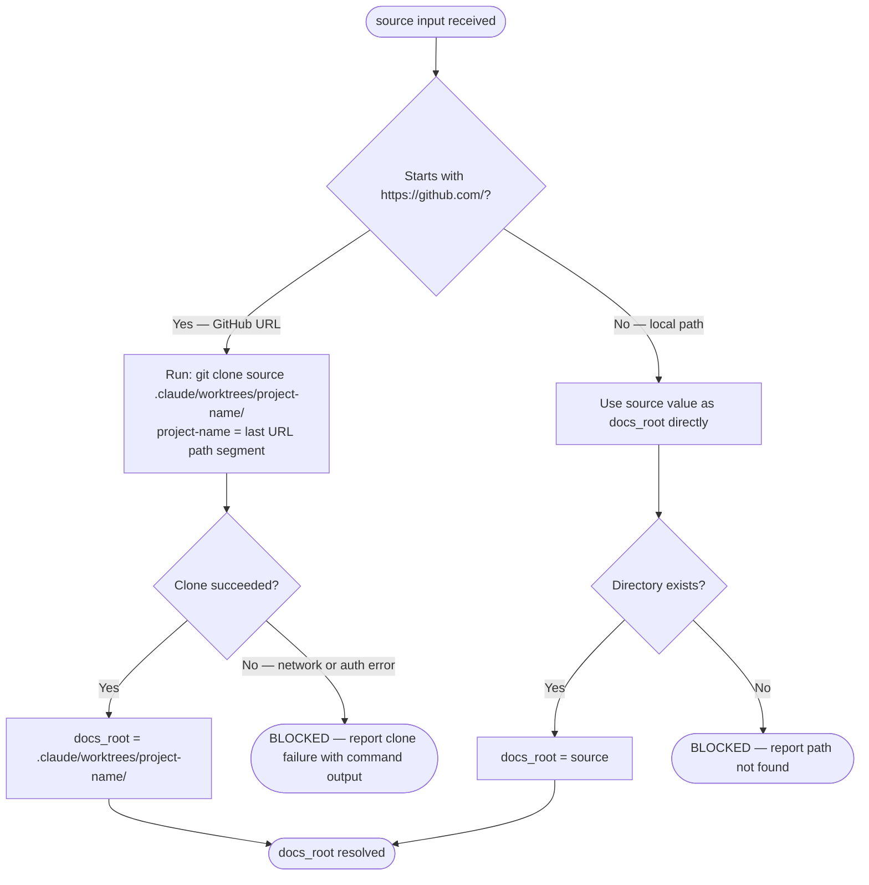
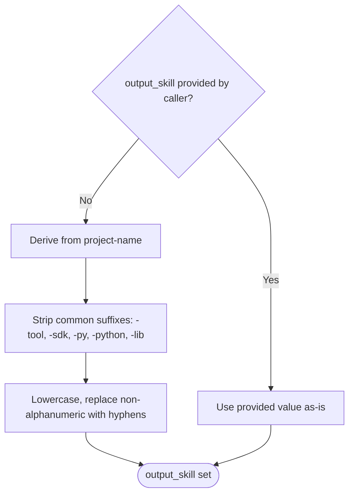
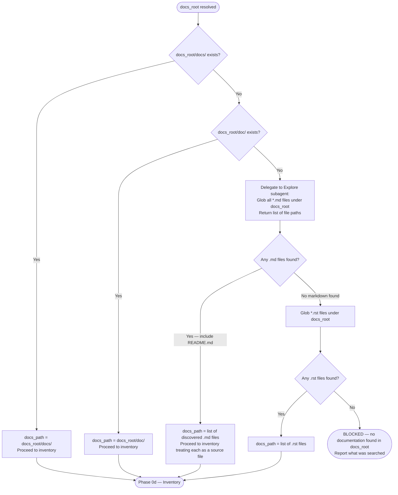

# Input Resolution and Docs Discovery

Covers Phase 0 of `user-docs-to-ai-skill` — resolving the `source` input to a local directory, deriving `output_skill` when not provided, and locating documentation within the resolved directory.

## Table of Contents

1. [Source Type Resolution](#source-type-resolution)
2. [Project Name Derivation](#project-name-derivation)
3. [output_skill Derivation](#output_skill-derivation)
4. [Docs Discovery](#docs-discovery)
5. [Anti-Patterns](#anti-patterns)

---

## Source Type Resolution



### Git Clone Command

```bash
git clone <source> .clone/worktrees/<project-name>/
```

- Path is relative to the project root — do not use absolute paths
- `project-name` is derived from the URL before cloning (see next section)
- If `.clone/worktrees/<project-name>/` already exists, skip the clone and use the existing directory

---

## Project Name Derivation

Extract `project-name` from the last non-empty path segment of the input.

| Input | project-name |
|-------|-------------|
| `https://github.com/astral-sh/ty` | `ty` |
| `https://github.com/anthropics/anthropic-sdk-python` | `anthropic-sdk-python` |
| `/home/user/repos/my-tool` | `my-tool` |
| `.claude/worktrees/fastmcp` | `fastmcp` |

Strip trailing slashes before extracting the segment.

---

## output_skill Derivation



**Examples:**

| project-name | output_skill |
|-------------|-------------|
| `ty` | `ty` |
| `anthropic-sdk-python` | `anthropic-sdk` |
| `fastmcp` | `fastmcp` |
| `httpx` | `httpx` |

---

## Docs Discovery

After `docs_root` is set, locate where the documentation lives.



### Explore Subagent Delegation

When no `docs/` or `doc/` directory exists, delegate discovery:

```text
Task: subagent_type="general-purpose"
Prompt: Glob all *.md and *.rst files under <docs_root>.
        Also check for a README.md at docs_root root level.
        Return the full list of file paths found.
        Do not read file contents — paths only.
Output: flat list of file paths
```

Use `general-purpose` (not `Explore`) because the Explore agent has a ~50% hallucination rate on pattern-matching tasks.

---

## Anti-Patterns

**Using absolute paths in clone destination:**

```bash
# WRONG
git clone https://github.com/astral-sh/ty /home/user/repos/.clone/worktrees/ty/

# CORRECT
git clone https://github.com/astral-sh/ty .clone/worktrees/ty/
```

**Hardcoding docs_path before checking:**

```text
# WRONG — assumes docs/ always exists
docs_path = docs_root + "/docs/"

# CORRECT — check first, fall back to discovery
```

**Fabricating output_skill from partial URL parsing:**

```text
# WRONG — astral-sh/ty parsed as "astral-sh"
project-name = first URL segment after github.com

# CORRECT — use the last segment
project-name = last URL path segment = "ty"
```
