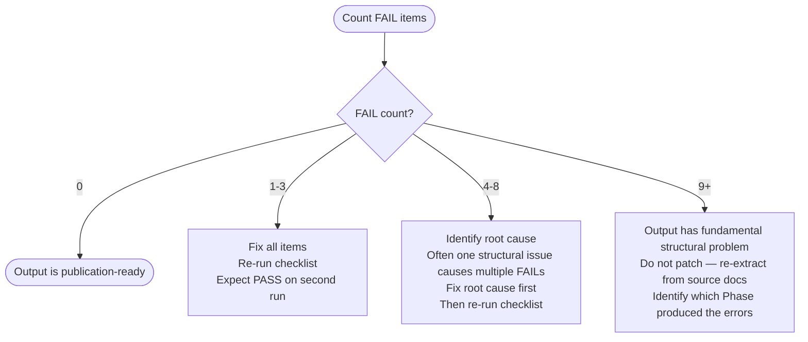

# Quality Criteria

Measurable criteria for evaluating the AI-facing skill output produced by `user-docs-to-ai-skill`. Apply this checklist in Phase 5 before declaring done. Every failing item must be fixed before reporting completion.

## Table of Contents

1. [Checklist — Apply Before Done](#checklist--apply-before-done)
2. [Scoring Guide](#scoring-guide)
3. [Common Failure Modes](#common-failure-modes)
4. [Distinguishing Good from Mediocre](#distinguishing-good-from-mediocre)

Checklist categories: Frontmatter — SKILL.md Structure — Reference Files — Links — Coverage — Format Handling — Workflow Identification

---

## Checklist — Apply Before Done

Run all items. Mark each PASS or FAIL. Fix all FAILs before proceeding.

### Frontmatter

- [ ] FM-1: `name` field matches the skill directory name exactly
- [ ] FM-2: `description` is a single line — no `>-`, `|-`, `>`, `|` multiline indicators
- [ ] FM-3: `description` contains no colons except in URLs
- [ ] FM-4: `description` front-loads a trigger scenario ("Use when...")
- [ ] FM-5: `description` names the domain tool or library explicitly
- [ ] FM-6: `allowed-tools` is present and uses comma-separated string format

### SKILL.md Structure

- [ ] SK-1: SKILL.md contains a Mermaid workflow flowchart covering primary task types
- [ ] SK-2: Every reference file in `references/` is linked from SKILL.md
- [ ] SK-3: SKILL.md does not duplicate content that belongs in a reference file
- [ ] SK-4: SKILL.md sections describe what to find in each reference file (2-3 sentences each)
- [ ] SK-5: SKILL.md token count is under 4000 — estimate by character count (1 token ≈ 4 chars)

### Reference Files

- [ ] RF-1: At least one reference file exists
- [ ] RF-2: All reference files have a `#` title heading
- [ ] RF-3: Reference files longer than 50 lines have a Table of Contents
- [ ] RF-4: All code blocks have language specifiers (`bash`, `toml`, `python`, `text`, etc.)
- [ ] RF-5: Verbatim content (CLI flags, param names, error messages) is preserved exactly — not paraphrased
- [ ] RF-6: No reference file contains motivational prose, analogies, or narrative scaffolding
- [ ] RF-7: Decision logic uses Mermaid flowcharts — not prose descriptions of conditions

### Links

- [ ] LK-1: All links from SKILL.md to references use `[text](./references/filename.md)` syntax
- [ ] LK-2: All referenced files exist at the linked paths
- [ ] LK-3: No absolute paths used in any link

### Coverage

- [ ] CV-1: Every major section of the source docs is represented by at least one atom in a reference file
- [ ] CV-2: CLI commands or API methods from source docs are in the output — none silently dropped
- [ ] CV-3: Error conditions documented in source docs are captured in a reference file
- [ ] CV-4: Configuration parameters from source docs appear with their types and defaults

### Format Handling

- [ ] FH-1: Non-markdown files (PDF, DOCX, PPTX, XLSX) are extracted using the MCP `file-reader` server or appropriate tool — not skipped
- [ ] FH-2: AsciiDoc admonition blocks (NOTE, TIP, WARNING, IMPORTANT, CAUTION) are converted to `TYPE: constraint` atoms
- [ ] FH-3: Jupyter notebook code cells are preserved verbatim as `TYPE: example` atoms
- [ ] FH-4: reStructuredText directives are mapped to corresponding atom types (code-block → example, warning → constraint)
- [ ] FH-5: HTML content is stripped of navigation, sidebars, and footers before extraction
- [ ] FH-6: Man page SYNOPSIS and OPTIONS sections produce `TYPE: command` and `TYPE: parameter` atoms respectively
- [ ] FH-7: Config file keys (TOML/YAML/JSON) with comments produce `TYPE: parameter` atoms with dot-notation paths
- [ ] FH-8: Scanned-image PDFs are flagged with a warning when text extraction yields empty results

### Workflow Identification (Phase 1.5)

- [ ] WF-1: Workflow-shaped content identified and delegated to process-siren
- [ ] WF-2: `resources/workflows/` directory contains validated Mermaid files for all identified workflows
- [ ] WF-3: Every workflow file is linked from SKILL.md under a `## Workflows` section
- [ ] WF-4: No workflow-shaped prose remains as bullet lists in reference files

### AI-Facing Language

- [ ] AI-1: Instructions use imperative form ("Extract all parameter names") not descriptive ("The skill will extract...")
- [ ] AI-2: No marketing copy, no motivational framing, no "this will help you" sentences
- [ ] AI-3: Conditional logic is expressed in structured form (flowchart or explicit if/then) — not in prose

---

## Scoring Guide

Count FAILs after first pass:



---

## Common Failure Modes

### Failure Mode 1 — Prose Dump

**Symptom:** Reference files contain long paragraphs copied from the source docs.

**Detection:** Any paragraph longer than 4 sentences in a reference file.

**Root cause:** Extraction Phase skipped or incomplete — raw doc content pasted instead of atoms extracted.

**Fix:** Re-run Phase 1 extraction on the affected sections. Extract atoms, then rewrite the reference section using those atoms.

---

### Failure Mode 2 — Missing Frontmatter

**Symptom:** SKILL.md frontmatter block is absent or incomplete.

**Detection:** The file opens without `---`, or `name`/`description`/`allowed-tools` are missing.

**Root cause:** Phase 4 (Write SKILL.md) executed before reading skill-structure-guide.md frontmatter rules.

**Fix:** Add correct frontmatter. Validate each field against FM-1 through FM-6 checklist items.

---

### Failure Mode 3 — No Progressive Disclosure

**Symptom:** SKILL.md contains paragraphs of domain knowledge instead of links to reference files.

**Detection:** Any section of SKILL.md longer than 10 lines that is not a flowchart, a quick-reference block, or a reference index.

**Root cause:** Author treated SKILL.md as the knowledge file rather than the routing layer.

**Fix:** Move inline knowledge blocks into appropriately-named reference files. Replace with 2-3 sentence description + link.

---

### Failure Mode 4 — Paraphrased Identifiers

**Symptom:** CLI flags, parameter names, or error messages are reworded from the source.

**Detection:** Compare a sample of 5 atoms to source docs. Any deviation in flag names, param names, or error strings is a failure.

**Example:**

```text
# Source doc: --python-version 3.12
# Paraphrased (WRONG): python version flag: 3.12
# Verbatim (CORRECT): --python-version 3.12
```

**Root cause:** Extraction Phase applied abstraction rules to identifiers (should only abstract narrative prose).

**Fix:** Re-extract the affected sections using verbatim preservation rules from extraction-patterns.md.

---

### Failure Mode 5 — Empty Themes

**Symptom:** A reference file exists but contains fewer than 3 atoms of knowledge.

**Detection:** Reference file body under 20 lines (excluding header and ToC).

**Root cause:** Over-splitting during Phase 2 thematic grouping.

**Fix:** Merge the thin reference file into an adjacent theme. Update the link in SKILL.md.

---

### Failure Mode 6 — Broken Links

**Symptom:** SKILL.md links to reference files that don't exist or use wrong paths.

**Detection:** Read each linked path with `Read(file_path)`. Any 404-equivalent is a failure.

**Fix:** Verify every link after writing all files. Correct any path that doesn't resolve.

---

### Failure Mode 7 — Vague Description

**Symptom:** The `description` field doesn't trigger auto-invocation for the intended use cases.

**Detection:** Read the description and ask: "Would Claude load this skill when a user says 'help me configure ty.toml'?" If the answer is uncertain, it's vague.

**Example:**

```text
# Vague (WRONG)
description: Knowledge about ty tool and its features

# Triggerable (CORRECT)
description: Use when working with ty — running type checks, configuring ty.toml, interpreting error codes, or targeting specific Python versions
```

**Fix:** Rewrite description using the template in skill-structure-guide.md. Include explicit trigger scenarios.

---

### Failure Mode 8 — Skipped Non-Markdown Formats

**Symptom:** Reference files only contain content from `.md` sources; PDF, DOCX, or other format files in the docs directory are ignored.

**Detection:** Compare the list of source files in the inventory (Phase 0d) against the SOURCE fields in all extracted atoms. Any source file with zero atoms is suspicious.

**Root cause:** Extraction Phase did not use the MCP `file-reader` server for binary formats or did not apply format-specific extraction patterns.

**Fix:** Re-run Phase 1 for the skipped files using the appropriate extraction method from [extraction-patterns.md](./extraction-patterns.md) Format-Specific Extraction section.

---

## Distinguishing Good from Mediocre

A mediocre output skill:

- Has a description that doesn't trigger on real user questions
- Contains reference files that are reformatted copies of the source docs
- Uses SKILL.md as a long-form knowledge document
- Has no decision logic — only flat prose
- Paraphrases CLI flags and parameter names
- Has no workflow flowchart

A good output skill:

- Triggers auto-invocation on natural user questions about the domain
- Extracts atoms from source docs — facts and constraints, not narrative
- Uses SKILL.md only for routing and linking
- Represents conditional logic as Mermaid flowcharts
- Preserves verbatim all identifiers (flags, params, errors, enum values)
- Has a clear workflow in the SKILL.md body that maps task types to reference files

The fastmcp-creator skill in `plugins/fastmcp-creator/skills/fastmcp-creator/` is the reference exemplar. Compare the output against it before declaring done.
