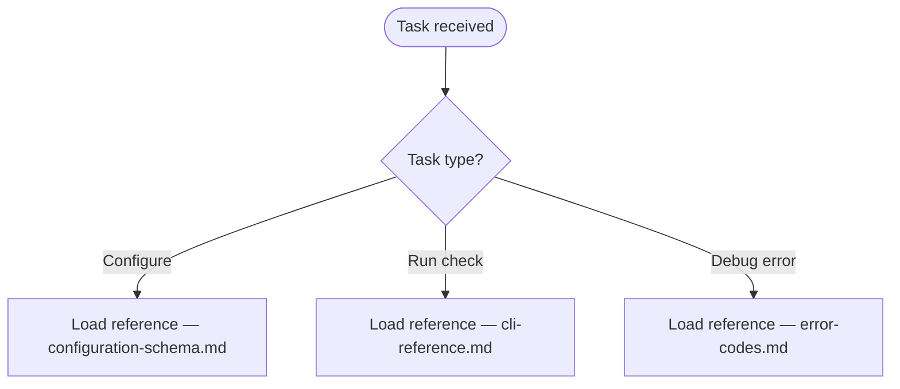
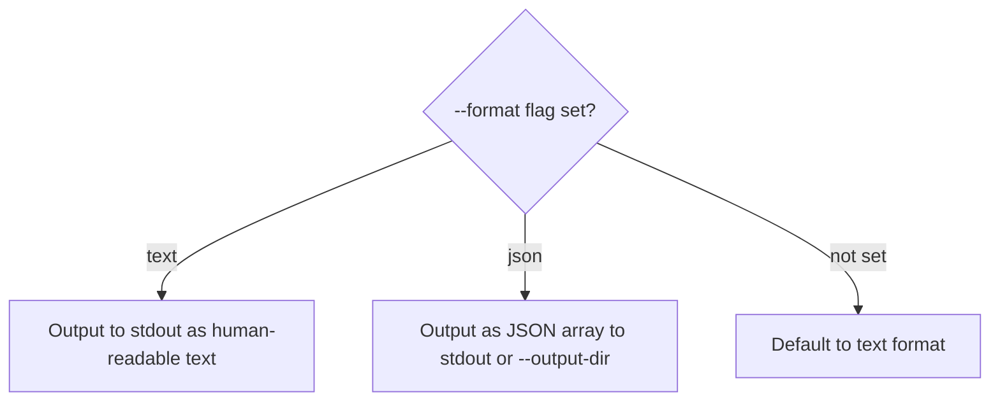

# Skill Structure Guide

How to structure the output skill directory, write valid SKILL.md frontmatter, name and format reference files, and link between them. This is the authoritative specification for the output produced by `user-docs-to-ai-skill`.

## Table of Contents

1. [Output Directory Layout](#output-directory-layout)
2. [plugin.json](#pluginjson)
3. [SKILL.md Frontmatter Rules](#skillmd-frontmatter-rules)
4. [SKILL.md Body Structure](#skillmd-body-structure)
5. [Reference File Naming](#reference-file-naming)
6. [Reference File Format](#reference-file-format)
7. [Link Syntax](#link-syntax)
8. [Progressive Disclosure Principle](#progressive-disclosure-principle)

---

## Output Directory Layout

```text
plugins/{output-plugin}/
├── .claude-plugin/
│   └── plugin.json
└── skills/
    └── {output-skill}/
        ├── SKILL.md
        └── references/
            ├── {theme-1}.md
            ├── {theme-2}.md
            └── {theme-3}.md
```

Minimum viable output: `SKILL.md` + at least one reference file. Maximum: 6 reference files.

---

## plugin.json

Write this file when creating a net-new plugin. Do not write it when improving an existing skill.

```json
{
  "name": "{output-plugin}",
  "version": "1.0.0",
  "description": "{one-line human description}",
  "author": {
    "name": "Generated by user-docs-to-ai-skill"
  },
  "skills": ["./skills/{output-skill}"]
}
```

> **⚠️ plugin.json auto-discovery — if registering this skill in a plugin**
>
> Skills in the default `skills/` directory are auto-discovered. Do NOT add them to plugin.json.
>
> If the skill is in a non-default location and must be declared:
> - Read the existing `skills` array in plugin.json first
> - Carry forward every existing entry — adding one without listing all others makes the rest invisible
> - It is all or nothing

---

## SKILL.md Frontmatter Rules

The frontmatter block is mandatory. Every field has strict formatting constraints.

### Required fields

| Field | Type | Constraint |
|-------|------|-----------|
| `name` | string | Matches the skill directory name exactly |
| `description` | string | Single line, no YAML multiline indicators, no colons except in URLs |
| `allowed-tools` | string | Comma-separated list, no YAML list syntax |

### description field

The description is the auto-invocation trigger. Claude Code matches it against user intent.

Rules:

- Single line — never use `>-`, `|-`, `>`, or `|` multiline indicators
- No colons — use em dashes (`—`) or semicolons (`;`) instead
- Front-load the trigger scenario — first sentence must answer "use this when..."
- Include the domain name (e.g., `ty`, `fastmcp`, `httpx`) prominently
- Include the task type (check, lint, configure, build, debug)
- Keep under 280 characters — longer descriptions reduce matching precision

**Template:**

```text
description: Use when working with {domain} — {primary task 1}, {primary task 2}, {primary task 3}. Covers {key concept A}, {key concept B}, and {key concept C}.
```

**Example (ty type checker):**

```text
description: Use when running ty type checks on Python code — configuring ty.toml, interpreting diagnostics, suppressing specific errors, or integrating ty into CI. Covers CLI flags, configuration schema, error codes, and Python version targeting.
```

### Frontmatter anti-patterns

```yaml
# WRONG — multiline indicator
description: >-
  Use when working with ty

# WRONG — colon breaks YAML parsing
description: "ty: Python type checker skill"

# WRONG — too vague, no trigger scenarios
description: Knowledge about the ty tool

# CORRECT
description: Use when working with ty — running type checks, configuring ty.toml, interpreting error codes, or targeting specific Python versions
```

---

## SKILL.md Body Structure

Write SKILL.md sections in this order:

### 1. Title and one-line summary

```markdown
# {Domain} Knowledge

{One sentence: what Claude can do with this skill loaded.}
```

### 2. Environment check (optional but recommended)

Include a `!` shell command to verify the tool is available:

```markdown
**{Tool} version:**
!`{tool} --version 2>/dev/null || echo "not found in PATH"`
```

### 3. Scope block

```markdown
## Scope

TRIGGER: Activate when the user asks about {domain task types}

COVERS:
- {topic 1}
- {topic 2}
- {topic 3}

DOES NOT COVER:
- {exclusion 1}
- {exclusion 2}
```

### 4. Workflow (Mermaid flowchart)

One flowchart covering the primary task types. Use `flowchart TD`.

````markdown
## Workflow


````

### 5. Reference index

One section per reference file. Each section:

- States what the reference covers (2-3 sentences)
- Links to the reference file
- States when to load it (trigger condition)

```markdown
## Reference Files

### CLI Reference

Complete flag syntax, subcommands, and invocation patterns.
Load when the user asks how to run {tool} or what flags to use.

[cli-reference.md](./references/cli-reference.md)

### Configuration Schema

All configuration keys, their types, defaults, and constraints.
Load when the user asks about ty.toml or configuration options.

[configuration-schema.md](./references/configuration-schema.md)
```

### 6. Quick reference (optional)

Include a compact cheat sheet for the most common operations. Keep under 30 lines.

---

## Reference File Naming

Theme slugs follow these rules:

- All lowercase
- Hyphens for word separation — no underscores, no spaces
- Descriptive of content, not audience (`cli-reference` not `for-developers`)
- Maximum 3 words

**Canonical theme names by domain:**

| Content type | Canonical slug |
|-------------|----------------|
| CLI commands and flags | `cli-reference` |
| Configuration file schema | `configuration-schema` |
| Error codes and messages | `error-codes` |
| Integration patterns | `integration-patterns` |
| Python API | `api-reference` |
| Best practices | `best-practices` |
| Common workflows | `common-workflows` |

---

## Reference File Format

Every reference file must follow this structure:

### Header block

```markdown
# {Theme Title}

{One paragraph: what this file contains and when to use it.}

## Table of Contents

1. [Section One](#section-one)
2. [Section Two](#section-two)
```

A Table of Contents is required for reference files longer than 50 lines. It enables Claude Code partial reads to locate relevant sections.

### Section structure

Each section:

- Starts with `##` heading
- Opens with one sentence stating what the section covers
- Contains knowledge atoms formatted for AI consumption (not narrative prose)
- Uses code blocks with language specifiers for all code

### Code blocks

Always include language specifiers:

````markdown
```bash
ty check --strict ./src
```

```toml
[tool.ty]
python-version = "3.12"
```

```text
error[invalid-return-type]: expected `int`, got `str`
```
````

### Parameter tables

Use tables only for flat parameter data (not decision branches):

```markdown
| Parameter | Type | Default | Constraint |
|-----------|------|---------|-----------|
| `python-version` | string | auto-detect | Must be 3.8–3.13 |
| `strict` | bool | false | Treats warnings as errors |
```

### Decision branches

Use Mermaid flowcharts for any if/else or conditional logic:

````markdown

````

---

## Link Syntax

All cross-references between files use markdown links with relative paths.

### From SKILL.md to references

```markdown
[cli-reference.md](./references/cli-reference.md)
```

### From one reference to another

```markdown
[configuration-schema.md](./configuration-schema.md)
```

### Never use

```markdown
<!-- WRONG — absolute path -->
[cli-reference.md](/home/user/repos/plugins/ty-skill/skills/ty/references/cli-reference.md)

<!-- WRONG — backtick path, not a link -->
`references/cli-reference.md`

<!-- WRONG — missing ./ prefix -->
[cli-reference.md](references/cli-reference.md)
```

---

## Progressive Disclosure Principle

SKILL.md is the routing layer. Reference files are the knowledge layer.

Rules enforcing this separation:

- SKILL.md must NOT contain inline knowledge that belongs in a reference file
- If a fact appears in SKILL.md, it must not be repeated in a reference file
- SKILL.md sections that describe a reference file's content must link to it — not duplicate it
- A reader of SKILL.md alone should understand what the skill can do and when to load each reference
- A reader of a reference file alone should find everything needed for that knowledge domain

**Test:** Can you delete SKILL.md and still use each reference file independently? If yes, the separation is correct. If no, some SKILL.md content needs to move to a reference file.
