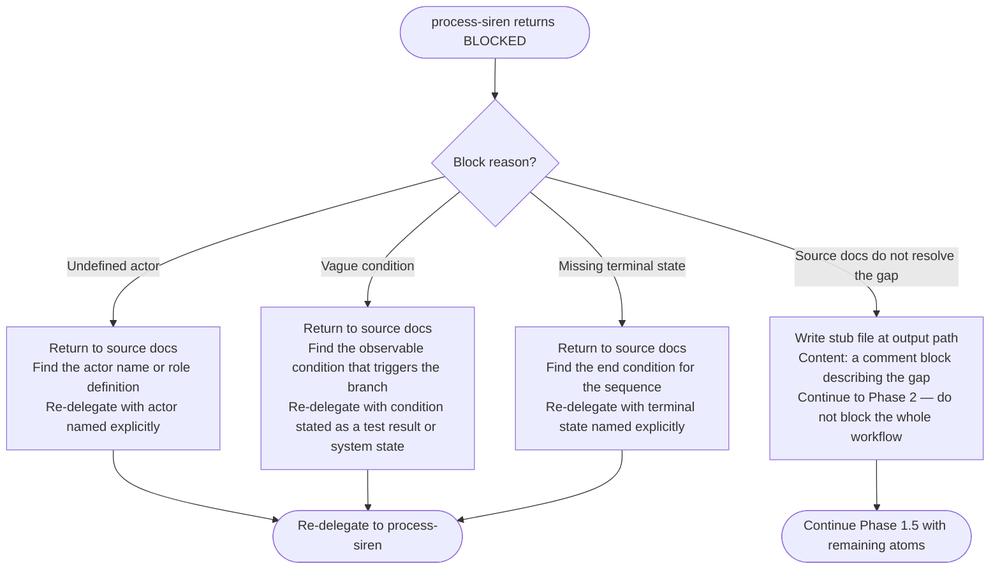

# Workflow Identification

Reference for Phase 1.5 of `user-docs-to-ai-skill`. Covers detection criteria, delegation prompt construction, blocking-condition responses, and output conventions for workflow files.

## Table of Contents

1. [What Makes Content Workflow-Shaped](#what-makes-content-workflow-shaped)
2. [Workflow-Shaped vs Non-Workflow-Shaped Examples](#workflow-shaped-vs-non-workflow-shaped-examples)
3. [Constructing the process-siren Delegation Prompt](#constructing-the-process-siren-delegation-prompt)
4. [Blocking Conditions and Responses](#blocking-conditions-and-responses)
5. [Output Directory Convention](#output-directory-convention)
6. [Linking Workflow Files from SKILL.md](#linking-workflow-files-from-skillmd)

---

## What Makes Content Workflow-Shaped

Content is workflow-shaped when it satisfies at least two of the following:

- **Decision conditions present** — the text describes observable branch conditions ("if the token is expired", "when the build fails", "unless the flag is set")
- **Multiple actors or states** — distinct roles or system states are named that transition between each other
- **Explicit terminal outcomes** — the sequence ends in a named success, failure, or stop condition
- **Order-dependent steps** — steps cannot be reordered without changing the outcome

Content that is merely sequential prose ("first do X, then do Y") without branching or defined terminal states is NOT workflow-shaped. Leave it as atoms for Phase 2 thematic grouping.

---

## Workflow-Shaped vs Non-Workflow-Shaped Examples

### Workflow-shaped (delegate to process-siren)

```text
To authenticate, the client sends a token. If the token is valid, the server returns a 200
with the resource. If the token is expired, the server returns a 401 and the client must
refresh. If the token is invalid, the server returns a 403 and the session is terminated.
```

Detection signals: branch conditions (valid / expired / invalid), explicit terminal states (200 OK, session terminated), named actors (client, server).

```text
Installation steps:
1. Check Python >= 3.10 is installed. If not, install it before continuing.
2. Run `uv add mylib`. If the command fails with a network error, retry once. If it fails
   again, check the proxy configuration.
3. Verify by running `mylib --version`. If version is not printed, reinstall.
```

Detection signals: conditional retry logic, observable failure conditions, terminal verification step.

### Not workflow-shaped (keep as atoms for Phase 2)

```text
To configure logging, set the log_level key in config.toml. Available values are DEBUG,
INFO, WARNING, ERROR. The default is INFO.
```

No branching, no terminal states — this is a parameter description. Extract as atoms.

```text
Run `uv run ty check` to type-check your project. Add --watch to run in watch mode.
```

Sequential steps with no conditions or branches. Extract as command atoms.

---

## Constructing the process-siren Delegation Prompt

Provide all three elements — source text, context, and output path — in every delegation:

```text
Task: subagent_type="process-siren:process-siren"

Source text (verbatim):
  [paste the raw prose or atom text exactly as extracted — do not paraphrase]

Context:
  This workflow represents [one sentence describing what the workflow governs].
  It is being extracted from [source filename or section].

Output file path:
  plugins/{output_plugin}/skills/{output_skill}/resources/workflows/{slug}.md
```

### Slug Derivation

Derive `{slug}` from the workflow topic using lowercase hyphenated form:

- Authentication decision tree → `auth-decision.md`
- Installation verification flow → `installation-verify.md`
- Error recovery sequence → `error-recovery.md`
- Configuration validation → `config-validation.md`

### What NOT to Do in the Delegation Prompt

```text
# WRONG — paraphrased content
Source text: "The user should authenticate first, then access is checked."

# WRONG — missing output path
Context: just convert this to a diagram

# WRONG — no context sentence
[raw prose with no explanation of what it represents]
```

---

## Blocking Conditions and Responses

process-siren blocks when it detects structural problems in the source content. Each blocking condition has a defined response.



### Stub File Format

When source docs cannot resolve a blocking condition, write the stub:

```markdown
# [Workflow Topic] — Manual Review Required

<!-- TODO: manual-workflow-needed
     Gap: [describe the specific undefined element]
     Source section: [filename:section where the content lives]
     Missing: [actor name | observable condition | terminal state]
     Action: A human must clarify this before the diagram can be generated.
-->
```

---

## Output Directory Convention

Workflow files for the output skill live at:

```text
plugins/{output_plugin}/skills/{output_skill}/resources/workflows/{slug}.md
```

Create the `resources/workflows/` directory as part of Phase 1.5 — do not wait for Phase 3 (Write Reference Files).

Each file produced by process-siren contains a validated Mermaid flowchart. No additional content is needed — the diagram is the artifact.

```text
# Auth Decision Flow

\`\`\`mermaid
flowchart TD
    Start([Client sends token]) --> Q{Token state?}
    Q -->|Valid| OK([200 — resource returned])
    Q -->|Expired| Refresh([401 — client must refresh token])
    Q -->|Invalid| Term([403 — session terminated])
\`\`\`
```

---

## Linking Workflow Files from SKILL.md

After all workflow files are written, add a `## Workflows` section to the output SKILL.md. Place it after the main workflow flowchart and before the reference files section.

```markdown
## Workflows

- [Auth Decision Flow](./resources/workflows/auth-decision.md)
- [Installation Verification](./resources/workflows/installation-verify.md)
- [Error Recovery Sequence](./resources/workflows/error-recovery.md)
```

Rules:

- One bullet per workflow file
- Link text is the human-readable name of the workflow (not the slug)
- Path uses `./resources/workflows/` prefix
- Do not inline the Mermaid diagram in SKILL.md — link only
