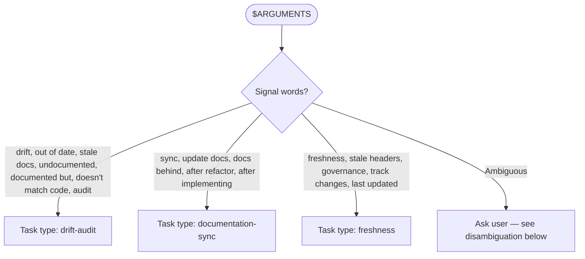
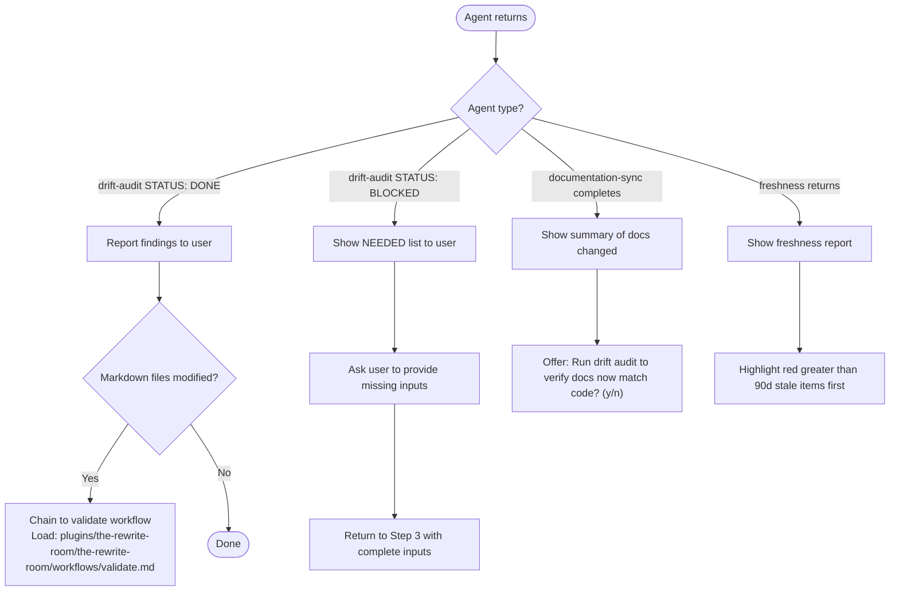

# Audit Workflow

Loaded by: `/rwr:audit` command
Orchestrator: Claude (reads this workflow and executes steps)

## Step 1 — Classify Task

Determine task type from $ARGUMENTS:



Disambiguation prompt when ambiguous:

> "Is this (a) checking if docs match code, (b) updating docs after code changed, or (c) tracking doc freshness?"

## Step 2 — Read Agent Protocol

Before spawning, read the target agent's file to understand its exact required inputs and output format:

- drift-audit: Read `plugins/development-harness/agents/doc-drift-auditor.md`
- documentation-sync: Read `plugins/development-harness/agents/service-docs-maintainer.md`
- freshness: Read `/home/ubuntulinuxqa2/.claude/agents/doc-freshness-guardian.md`

## Step 3 — Spawn Agent

Construct prompt using exact input format the agent expects (from Step 2 read).

For drift-audit:

```text
Task(
  subagent_type="development-harness:doc-drift-auditor",
  prompt="<task description>

Scope: <file paths or directories>
Project root: <path>"
)
```

For documentation-sync:

```text
Task(
  subagent_type="development-harness:service-docs-maintainer",
  prompt="<description of what code changed>

Affected files: <list>"
)
```

Note: service-docs-maintainer does NOT write a summary file — its output is response text only.

For freshness:

```text
Task(
  subagent_type="doc-freshness-guardian",
  prompt="<task description>

Files to check: <list>"
)
```

## Step 4 — Handle Return



## Output Contract

```text
STATUS: DONE|BLOCKED|FAILED
SUMMARY: [1-2 sentences — what was audited/synced, key findings count]
ARTIFACTS: [files created/modified with relative paths, or "none"]
VALIDATION:
  - citation-check: PASS|FAIL (drift-audit only — all findings have file:line evidence)
  - link-check: PASS|FAIL (if markdown files modified)
NOTES: [only if needed]
```
