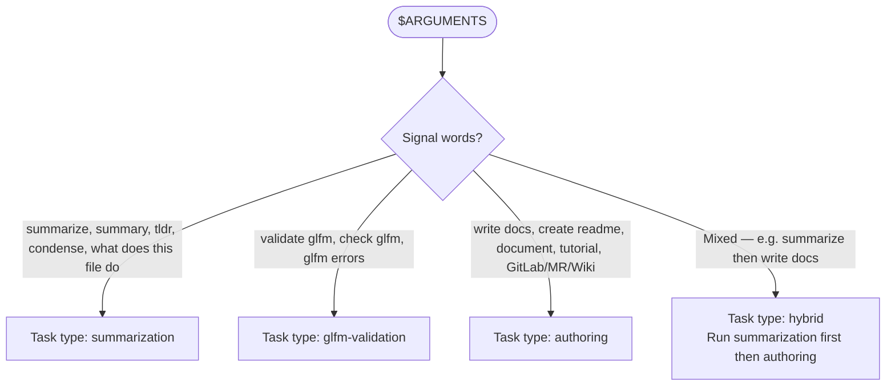
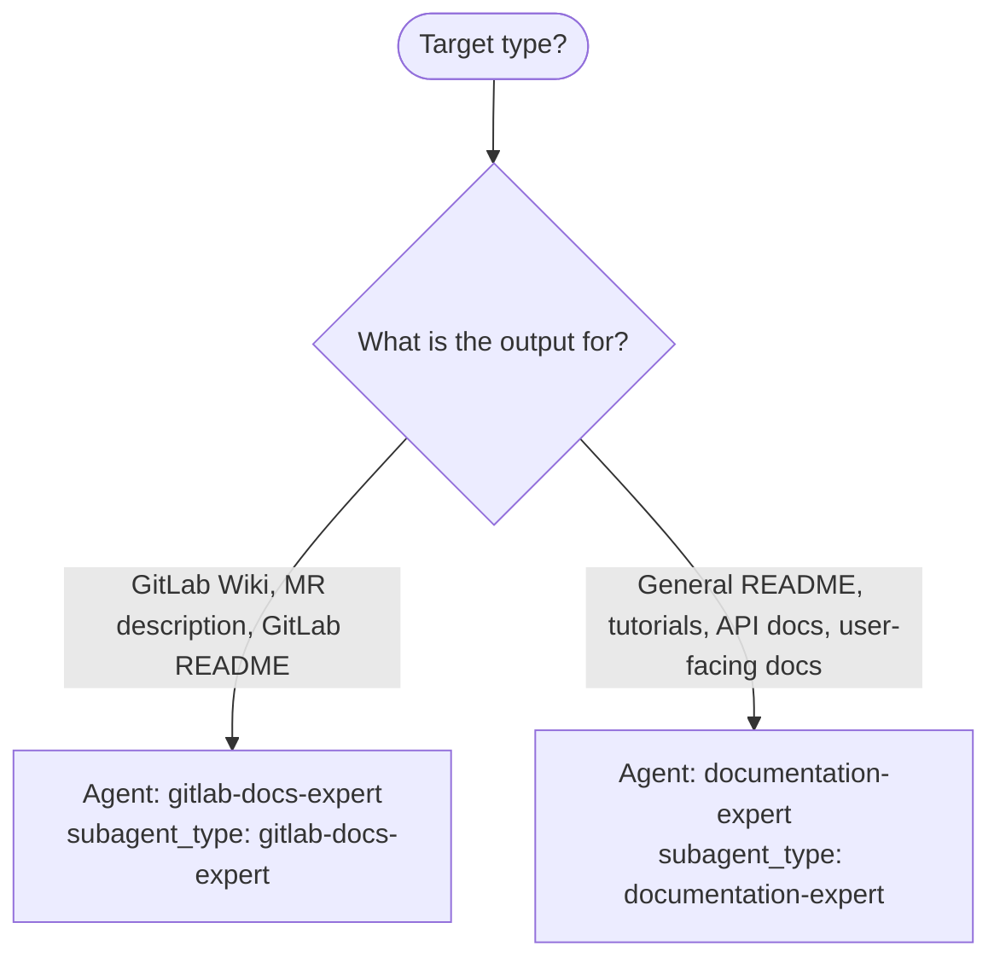
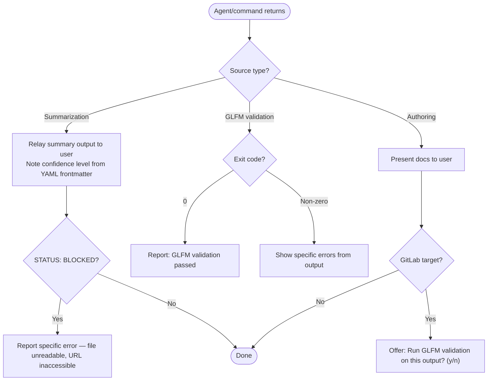

# Author Workflow

Loaded by: `/rwr:author` command
Orchestrator: Claude (reads this workflow and executes steps)

## Step 1 — Classify Task



## Step 2 — Route by Subtype

### Summarization routing

Read `plugins/summarizer/skills/summarizer/references/fidelity-rules.md` BEFORE spawning any summarizer agent.

```mermaid
flowchart TD
    Source([Source type?]) --> Q{What is the input?}
    Q -->|File path| FileSumm[Agent: summarizer:file-summarizer\nPrerequisite: file greater than 5000 chars per fidelity rules]
    Q -->|URL| URLSumm[Agent: summarizer:url-summarizer]
    Q -->|Image/screenshot path| ImgSumm[Agent: summarizer:image-summarizer]
    Q -->|Multiple mixed sources| Multi[Load summarizer skill — handles multi-source synthesis\nSkill(command: "summarizer:summarizer")]
```

### GLFM validation routing

Read `plugins/gitlab-skill/skills/gitlab-skill/references/glfm-syntax.md` before running validation.

Run directly (no subagent needed):

```bash
uv run plugins/gitlab-skill/skills/gitlab-skill/scripts/validate_glfm.py --file <path>
```

Requires `GITLAB_TOKEN` env var. If not set, report:

```text
BLOCKED — GITLAB_TOKEN environment variable required for GLFM validation.
```

### Authoring routing



## Step 3 — Spawn Agent (if needed)

For file-summarizer:

```text
Task(
  subagent_type="summarizer:file-summarizer",
  prompt="Summarize this file.

file_path: <path>
format: <structured|bullets|tldr|json|table|outline — default structured>"
)
```

For url-summarizer:

```text
Task(
  subagent_type="summarizer:url-summarizer",
  prompt="Summarize this URL.

url: <url>
format: <format — default structured>"
)
```

For image-summarizer:

```text
Task(
  subagent_type="summarizer:image-summarizer",
  prompt="Describe this image.

image_path: <path>
format: <format — default structured>"
)
```

For gitlab-docs-expert:

```text
Task(
  subagent_type="gitlab-docs-expert",
  prompt="<task description>

Target: <file or wiki page path>
Audience: <who will read this>"
)
```

For documentation-expert:

```text
Task(
  subagent_type="documentation-expert",
  prompt="<task description>

Target: <file path>
Audience: <who will read this>

Content preservation rules — no-loss rewrite:
- PRESERVE: usage examples and command invocations with flags
- PRESERVE: before/after behavioral examples
- PRESERVE: prerequisites and requirements sections
- PRESERVE: component/feature tables (restructure or move to docs/ with link if too dense)
- PRESERVE: badges
- PRESERVE: workflow descriptions
- ACCEPTABLE: rewrite prose for clarity, restructure sections, move dense reference content to docs/ files with links from README
- NOT ACCEPTABLE: removing any of the above content categories. Length reduction is not a quality signal when content is lost."
)
```

## Step 4 — Handle Return



Note: validate_glfm.py calls GitLab API — requires network and GITLAB_TOKEN.

## Output Contract

```text
STATUS: DONE|BLOCKED|FAILED
SUMMARY: [what was created/summarized/validated]
ARTIFACTS: [files created or "none" for summaries presented inline]
VALIDATION:
  - glfm-valid: PASS|FAIL|SKIPPED (skipped if not GitLab target)
  - fidelity-check: PASS|FAIL|SKIPPED (skipped if not summarization)
NOTES: [only if needed]
```
