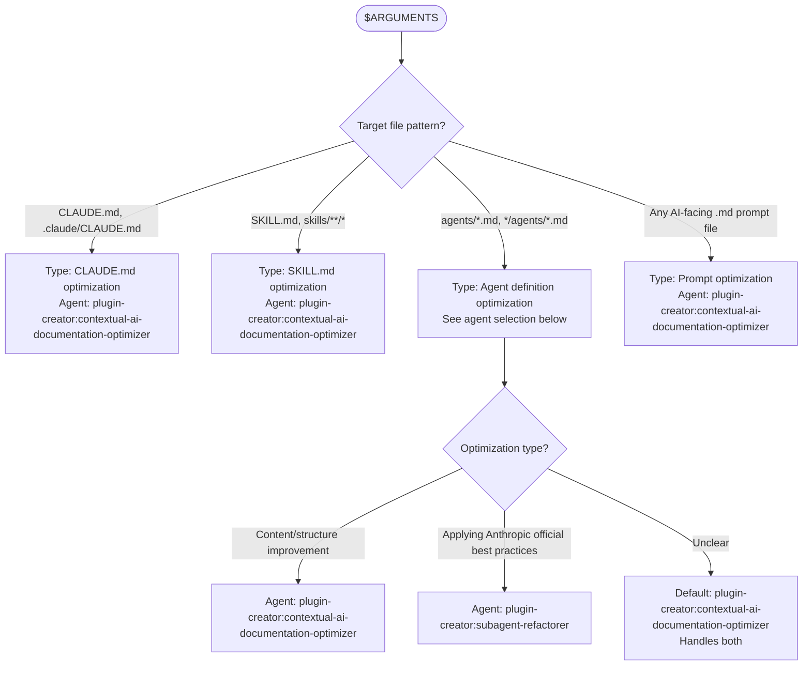
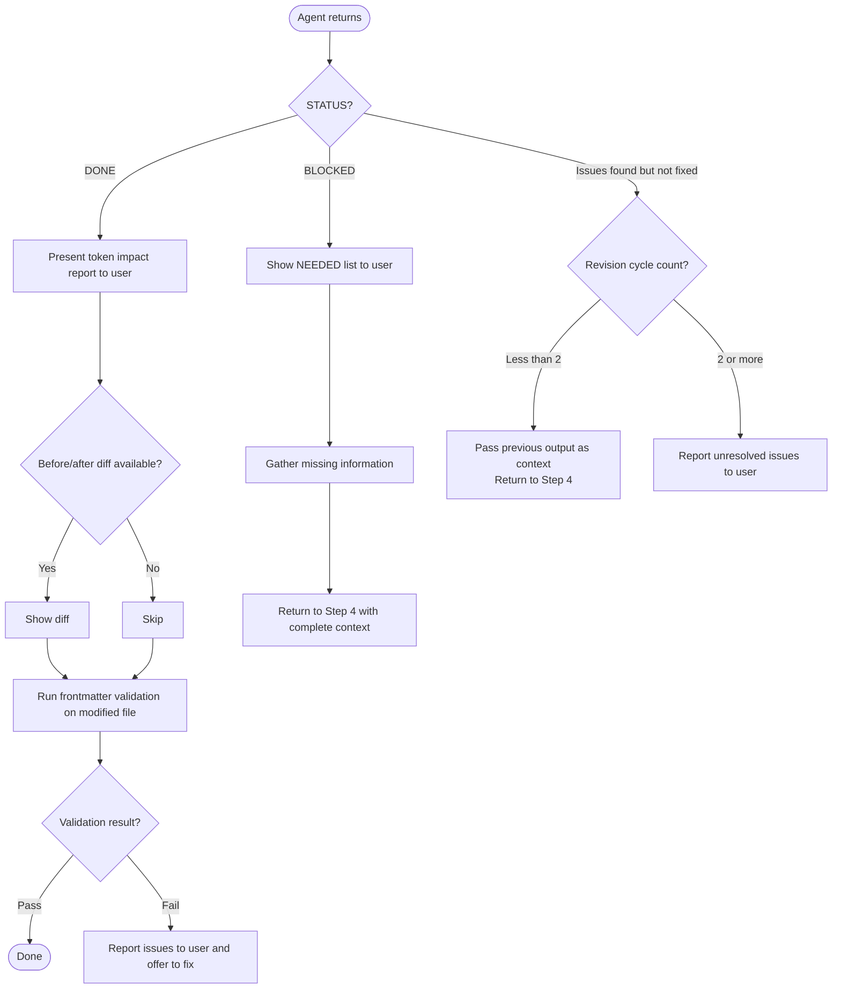

# Optimize Workflow

Loaded by: `/rwr:optimize` command
Orchestrator: Claude (reads this workflow and executes steps)

## Step 1 — Read Prompt Optimization Principles

Before ANY optimization task, load the knowledge reference:

Read `plugins/prompt-optimization-claude-45/skills/prompt-optimization-claude-45/SKILL.md`

Key principle to carry forward: positive framing over prohibitions (models attend to key nouns — "NEVER use X" still activates "use X"). The optimizer will fix prohibition patterns.

## Step 2 — Classify Target



## Step 3 — Read Agent Protocol

Before spawning, read the agent's file:

- contextual-ai-documentation-optimizer: Read `plugins/plugin-creator/agents/contextual-ai-documentation-optimizer.md`
  - Note: It runs its own RT-ICA blocking gate. Do not pre-empt it.
  - Note: Pass file PATH — never pre-summarize file content for it.

- subagent-refactorer: Read `plugins/plugin-creator/agents/subagent-refactorer.md`
  - Note: It has a MANDATORY research phase reading official Anthropic docs first.

## Step 4 — Spawn Agent

For contextual-ai-documentation-optimizer:

```text
Task(
  subagent_type="plugin-creator:contextual-ai-documentation-optimizer",
  prompt="Optimize the following file for Claude comprehension:

File: <path>

Target audience: AI-facing
Constraints: [any specific constraints from user]"
)
```

For subagent-refactorer:

```text
Task(
  subagent_type="plugin-creator:subagent-refactorer",
  prompt="Refactor this agent using Anthropic official best practices:

Agent file: <path>

Target model: [sonnet/opus if specified, default sonnet]
Specific issues: [if any identified]"
)
```

## Step 5 — Handle Return



Frontmatter validation command:

```bash
uv run plugins/plugin-creator/scripts/validate_frontmatter.py <modified-file>
```

Revision context prompt template:

```text
"Previous attempt found: [issues]. Please address these specifically."
```

## Output Contract

```text
STATUS: DONE|BLOCKED|FAILED
SUMMARY: [file optimized, key improvements made]
ARTIFACTS: [modified file path]
VALIDATION:
  - frontmatter-valid: PASS|FAIL
  - token-impact: [before → after token count if reported]
NOTES: [only if needed]
```
