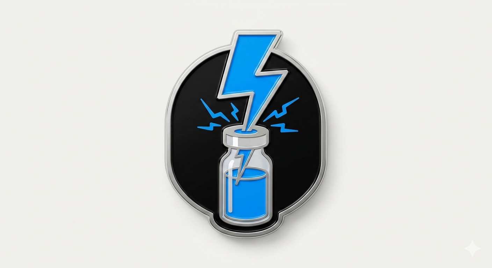

<p align="center">
  
</p>

# uv — Astral's Python Package Manager

Gives Claude expert knowledge of [uv](https://docs.astral.sh/uv/), the fast Python package and project manager that replaces pip, pip-tools, pipx, poetry, pyenv, and virtualenv.

## Why Install This?

Without this plugin, Claude may suggest `pip install`, `python -m venv`, or Poetry commands — slower tools with less precise dependency resolution. With it, Claude defaults to uv across all Python tasks and knows the correct command syntax for every uv workflow.

## Compatibility Note

This plugin provides the uv skill as a standalone install. The same skill is also included in the `python3-development` and `python-engineering` plugins. If you have either of those installed, you already have this skill.

## What You Get

Claude gains expert knowledge of uv for:

- **Project management** — `uv init`, `pyproject.toml`, workspaces, lockfiles
- **Dependency management** — `uv add`, `uv remove`, `uv lock --upgrade`
- **Script development** — PEP 723 inline metadata for portable single-file scripts
- **Tool management** — global CLI tools (`uv tool install`), ephemeral runs (`uvx`)
- **Python version management** — CPython, PyPy, GraalPy, free-threaded builds
- **CI/CD integration** — GitHub Actions, Docker, pre-commit/prek hooks
- **Migration support** — from pip, Poetry, pip-tools, or conda to uv

## Key Commands

### Project Initialization

```bash
# Standard application project
uv init myapp --app

# Library project with src/ layout
uv init mylib --lib --build-backend hatchling

# Initialize PEP 723 standalone script
uv init --script example.py --python 3.12
```

### Dependency Management

```bash
# Add production dependencies
uv add requests 'flask>=2.0,<3.0' pydantic

# Add development dependencies
uv add --dev pytest pytest-mock ruff

# Add to a dependency group
uv add --group docs sphinx sphinx-rtd-theme

# Remove a dependency
uv remove requests

# Upgrade all packages
uv lock --upgrade

# Upgrade specific packages
uv lock --upgrade-package requests
```

### Running Code

```bash
# Run script in project environment
uv run python script.py

# Run module
uv run -m pytest
uv run -m flask run --port 8000

# Run with additional temporary dependencies
uv run --with httpx --with rich script.py

# Run with a specific Python version
uv run --python 3.11 script.py
```

### PEP 723 Inline Scripts

```bash
# Add dependencies to a standalone script
uv add --script example.py requests rich

# Run a PEP 723 script (deps installed automatically)
uv run example.py

# Lock script for reproducibility
uv lock --script example.py
```

Example PEP 723 script structure:

```python
#!/usr/bin/env -S uv run --quiet
# /// script
# requires-python = ">=3.11"
# dependencies = [
#   "requests",
#   "rich",
# ]
# ///

from rich.console import Console
import requests

console = Console()
```

### Tool Management

```bash
# Run a tool without installing (ephemeral)
uvx ruff check .
uvx pycowsay "hello"

# Install a tool globally
uv tool install ruff black mypy

# Install specific version
uv tool install 'ruff>=0.3.0'
```

### Python Version Management

```bash
# Install a Python version
uv python install 3.12

# Install multiple versions at once
uv python install 3.11 3.12 3.13

# List installed versions
uv python list
```

### Virtual Environments

```bash
# Create virtual environment
uv venv

# Create with specific Python version
uv venv --python 3.12

# Sync project dependencies to environment
uv sync

# Sync including dev dependencies
uv sync --dev
```

## Migration Quick Reference

| Old command | uv equivalent |
|---|---|
| `pip install requests` | `uv add requests` |
| `pip install -r requirements.txt` | `uv sync` |
| `python -m venv .venv` | `uv venv` |
| `poetry add requests` | `uv add requests` |
| `poetry install` | `uv sync` |
| `pyenv install 3.12` | `uv python install 3.12` |
| `pipx run ruff` | `uvx ruff` |
| `pipx install ruff` | `uv tool install ruff` |

## Self-Updating Documentation

The underlying skill includes a sync script that fetches the latest uv release notes from GitHub:

```bash
# Check for new releases (dry run)
uv run plugins/uv/skills/uv/scripts/sync_uv_releases.py --dry-run

# Update skill documentation
uv run plugins/uv/skills/uv/scripts/sync_uv_releases.py
```

## Installation

First, add the marketplace (one-time setup):

```bash
/plugin marketplace add Jamie-BitFlight/claude_skills
```

Then install the plugin:

```bash
/plugin install uv@jamie-bitflight-skills
```

## Requirements

- Claude Code v2.0+
- uv installed on your system (`curl -LsSf https://astral.sh/uv/install.sh | sh`)

## References

- [uv Documentation](https://docs.astral.sh/uv/)
- [uv GitHub](https://github.com/astral-sh/uv)
- [PEP 723 — Inline Script Metadata](https://peps.python.org/pep-0723/)
