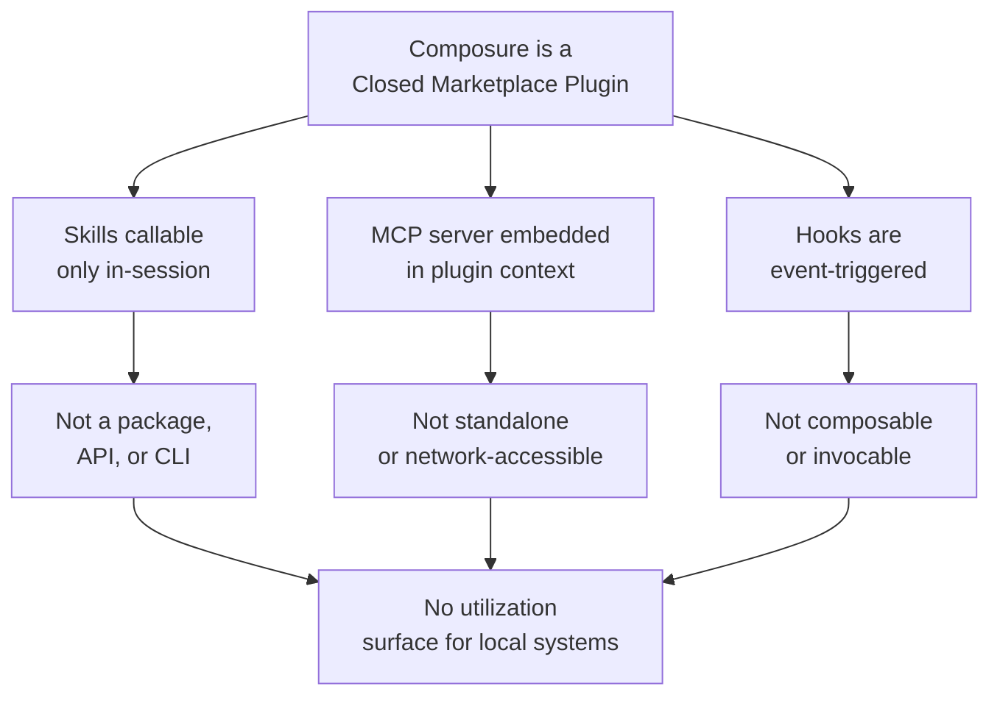

# Utilization Assessment: Composure

**Research entry**: ./research/agent-frameworks/composure.md
**Generated**: 2026-03-23
**Assessment**: No direct utilization surface

---

## Summary

Composure is a **closed-source marketplace plugin** for Claude Code that enforces code quality through automated hooks, skills, and an MCP code review knowledge graph. While it documents valuable architectural patterns (three-layer hook gating, SQLite-backed code graphs, severity-tracked task queues), **it does not expose a callable API, package, or CLI** that local agents or skills could integrate as a service dependency.

---

## Integration Surfaces Analyzed

### 1. Skills (e.g., `/composure:initialize`, `/composure:review-pr`)

**Surface type**: Claude Code skills (callable within session)

**Why not utilizable**:
- Accessible only after Composure marketplace plugin is installed
- Requires explicit user action to install (`claude plugin install`)
- Not a package, API, or subprocess invocation — session-local only
- No documented SDK or programmatic call mechanism
- Our local skills do not depend on external plugins for functionality

**Local systems checked**: `code-review` agent, `external-pattern-integrator` skill
- `code-review` performs its own review logic; no dependency on external review tools
- `external-pattern-integrator` learns from external patterns but does not invoke them as services

### 2. MCP Server (graph/)

**Surface type**: MCP server with 7 tools (TypeScript, Node.js 22.5+)

**Tools documented**:
- `build_or_update_graph`
- `query_graph`
- `get_review_context`
- `get_impact_radius`
- `find_large_functions`
- `semantic_search_nodes`
- `list_graph_stats`

**Why not utilizable**:
- Runs only within Composure plugin context (embedded in plugin)
- No public MCP registry entry or standalone deployment documented
- Requires Node.js 22.5+ and Composure plugin to be installed
- Not accessible as an independent network service or subprocess

### 3. Hooks (8 automated hooks)

**Surface type**: Claude Code hooks (event-triggered automation)

**Hook types**: command (bash), prompt (LLM), agent (mini Claude agents)

**Why not utilizable**:
- Hooks are **triggered by events**, not called as services
- Cannot be invoked from external agents or skills
- Not composable or dependency-injectable
- Each hook fires automatically; no way to depend on or call them from code

### 4. Configuration (`.claude/no-bandaids.json`)

**Surface type**: Static JSON config file

**Why not utilizable**:
- Configuration schema, not an API or service
- Not a dependency or integration point
- No documented way to programmatically inject or override rules

---

## Why Composure Cannot Be Integrated

---

## What Composure Offers Instead

| Offering | Type | Value to Local Systems |
|----------|------|----------------------|
| Hook architecture (3-layer gates) | Pattern | Study for designing local hook systems |
| Code review knowledge graph (tree-sitter + SQLite) | Architecture | Reference for building code relationship indices |
| Multi-language anti-pattern rules | Rules | Pattern catalog — not executable locally without reimplementation |
| Severity-tracked task queue | Data structure | Design pattern for prioritization systems |
| Context7 integration | Integration pattern | Shows how to fetch current framework docs |

**These are learning resources and architectural references, not callable services.**

---

## Backlog Items Recommended

If the team wants to adopt Composure's patterns, create backlog items for:

1. **Study hook-based architecture**: How does Composure's three-layer gate (command → prompt → agent) improve validation latency?
2. **Code relationship graph design**: If we build code understanding into local agents, what would be the schema and query patterns?
3. **Anti-pattern detection for local languages**: Which of Composure's multi-language rules should we implement locally?
4. **Task queue prioritization**: How should we design a persistent, severity-tracked task queue for local workflows?

---

## Conclusion

**STATUS**: No utilization surface

**REASON**: Composure is a closed plugin with no programmatic API, callable CLI, or package integration point. The skills, MCP server, and hooks are all scoped to the plugin's runtime context and cannot be invoked from external local systems.

**ALTERNATIVE**: Use Composure as an **architectural reference**. If code quality enforcement, hook-based automation, or code graphs align with project goals, document those patterns and design local implementations.
