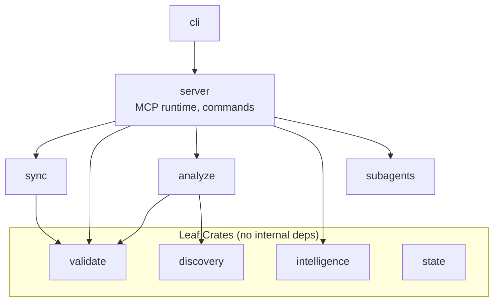

# Skrills

**Research Date**: 2026-02-23
**Source URL**: <https://github.com/athola/skrills>
**GitHub Repository**: <https://github.com/athola/skrills>
**Documentation**: <https://athola.github.io/skrills/>
**Version at Research**: v0.5.6
**License**: MIT

---

## Overview

Skrills is a Rust-based skills support engine for Claude Code, OpenAI Codex CLI, and GitHub Copilot CLI. It validates skills against each CLI's specific rules (Claude Code permissive, Codex/Copilot strict character limits), syncs skills bidirectionally across all three environments to prevent configuration drift, and analyzes token usage to fit context windows. The built-in MCP server exposes 40+ tools for validation, sync, and project-aware skill generation, while session mining improves recommendations based on actual usage patterns.

---

## Problem Addressed

| Problem | Solution |
|---------|----------|
| Different YAML frontmatter rules per CLI (Codex/Copilot require `name` ≤100 chars, `description` ≤500 chars; Claude is permissive) | Validation engine checks compatibility for each target and auto-derives or fixes missing frontmatter via `--autofix` |
| Configuration drift when skills diverge across Claude Code, Codex CLI, and Copilot CLI | Bidirectional sync with file hashing to respect manual edits; `sync-all` mirrors in one command |
| Skills bloating context windows with unnecessary tokens | Token counting per skill with `--min-tokens` threshold and actionable reduction suggestions |
| Circular or unresolvable skill dependencies | Dependency resolution with cycle detection and semantic versioning constraints |
| No standard way to generate skills for a specific project | `intelligence` crate analyzes project structure and generates context-aware skills via LLM (`ANTHROPIC_API_KEY` or `OPENAI_API_KEY`) |
| MCP tooling for skill management not available to agents | Built-in MCP server with 40+ tools usable from Claude Code and other MCP clients |
| Copilot CLI lacking slash command support | Sync layer skips commands for Copilot and auto-transforms agents (removes `model`/`color`, adds `target: github-copilot`) |

---

## Key Statistics

| Metric | Value | Date Gathered |
|--------|-------|---------------|
| GitHub Stars | 52 | 2026-02-23 |
| Forks | 8 | 2026-02-23 |
| Open Issues | 15 | 2026-02-23 |
| Contributors | 1 | 2026-02-23 |
| Latest Release | v0.5.6 | 2026-02-23 |
| Release Date | 2026-02-01 | 2026-02-23 |
| Created | 2025-11-24 | 2026-02-23 |
| Language | Rust | 2026-02-23 |

---

## Key Features

### Validation Engine

- Validates skills against Claude Code (permissive), Codex CLI (strict), and GitHub Copilot CLI (strict) rules
- Auto-derives missing YAML frontmatter from file paths and content
- `--autofix` flag adds missing fields to reach compliance without manual edits
- `skrills doctor` command verifies full environment health including MCP registration

### Multi-CLI Sync

- `sync-all` mirrors skills, commands, agents, MCP servers, and preferences across all three CLIs
- `sync-from-claude` for one-directional Claude Code → Codex/Copilot propagation
- File hashing prevents overwriting intentional manual edits in target CLIs
- `--skip-existing-commands` flag preserves local command customizations
- Copilot sync skips slash commands (unsupported) and auto-transforms agent metadata

### Token Analysis & Optimization

- Per-skill token counting identifies large skills approaching context limits
- `--min-tokens N` filters to skills exceeding a threshold
- Actionable reduction suggestions via `--suggestions` flag
- `skill-score` command calculates quality scores balancing brevity and completeness

### Skill Lifecycle Management (39 CLI Commands)

- `skill-deprecate` — mark skill obsolete with migration guidance and replacement pointer
- `skill-rollback` — revert skill to a prior version by commit SHA
- `skill-import` — import skills from URLs or local paths
- `skill-catalog` — browse/search available skills with `--filter`
- `skill-profile` — view per-skill performance metrics and usage patterns
- `skill-usage-report` — export usage data as JSON for analysis

### MCP Server (40+ Tools)

- `skrills serve` starts an MCP server over stdio or HTTP with optional TLS
- Exposes tools for validation, sync, skill generation, and token analysis
- Usable from Claude Code as an MCP integration: project-aware skill generation without leaving the conversation
- TLS certificate management: auto-generate self-signed certs, renew, or install custom certs
- Auth token and CORS configuration for production deployments

### Session Mining & Recommendations

- Parses Claude Code and Codex CLI session history to identify frequently used patterns
- Improves skill recommendations based on actual usage, not just file structure
- Project analysis infers language, framework, and task type to prioritize relevant skills

### Interactive TUI

- `skrills tui` launches a terminal UI for browsing skills, validating, and syncing without memorizing commands
- Useful for initial setup and exploring a skill library interactively

---

## Technical Architecture

Skrills is a Rust multi-crate workspace with leaf crates holding no internal dependencies to prevent cycles:



| Crate | Purpose |
|-------|---------|
| `cli` | Thin binary wrapper |
| `server` | MCP server, CLI commands, HTTP transport, security middleware, TUI |
| `sync` | Bidirectional Claude/Codex/Copilot sync with `AgentAdapter` per target |
| `validate` | Skill validation rules for each CLI target |
| `analyze` | Token counting, dependency analysis, optimization |
| `intelligence` | Recommendations, project analysis, LLM-based skill generation |
| `discovery` | Skill/agent discovery and ranking |
| `state` | Environment config, manifest settings, runtime overrides |
| `subagents` | Shared subagent runtime and pluggable backends |
| `test-utils` | Shared test infrastructure (fixtures, RAII guards, temp dirs) |

**Key design patterns**:

- `AgentAdapter` trait for pluggable per-CLI adapters (Claude, Codex, Copilot)
- `SyncOrchestrator<S, T>` with compile-time dispatch for type-safe sync
- Feature flags gate `subagents` and other optional crates to minimize binary size
- `app` module split at 2500 LOC threshold (ADR-0001) to enforce extractability

---

## Installation & Usage

```bash
# macOS / Linux (installer script)
curl -LsSf https://raw.githubusercontent.com/athola/skrills/HEAD/scripts/install.sh | sh

# crates.io
cargo install skrills

# Windows PowerShell
powershell -ExecutionPolicy Bypass -NoLogo -NoProfile -Command \
  "Remove-Item alias:curl -ErrorAction SilentlyContinue; iwr https://raw.githubusercontent.com/athola/skrills/HEAD/scripts/install.ps1 -UseBasicParsing | iex"
```

```bash
# Validate skills for Codex/Copilot compatibility (with auto-fix)
skrills validate --target all --autofix

# Validate only for Codex
skrills validate --target codex

# Analyze token usage (show skills over 1000 tokens with suggestions)
skrills analyze --min-tokens 1000 --suggestions

# Sync all skills from Claude to Codex and Copilot
skrills sync-all

# Start MCP server (stdio transport)
skrills serve

# Start MCP server with HTTPS
skrills serve --tls-auto

# Interactive terminal UI
skrills tui

# Environment health check
skrills doctor
```

```toml
# ~/.skrills/config.toml
[serve]
auth_token = "your-secret-token"
tls_auto = true
cors_origins = "https://app.example.com"
```

---

## Relevance to Claude Code Development

### Applications

- **Pre-commit validation** — run `skrills validate --target all` in CI to catch frontmatter issues before skills reach Codex or Copilot users
- **Cross-CLI skill distribution** — maintain one authoritative set of skills in Claude Code and sync to Codex/Copilot automatically
- **Token budget management** — identify skills that consume excessive context window space and reduce them before they degrade session quality
- **MCP-based skill tooling** — expose `skrills serve` as an MCP integration so Claude Code can validate, generate, and sync skills without leaving the conversation

### Patterns Worth Adopting

- **Strict vs. permissive validation tiers** — having a permissive base with optional strict checks per target allows gradual hardening of skill quality
- **File-hash-based sync protection** — prevents automated sync from silently overwriting manual edits; a safe default for any sync tool
- **ADR-enforced module size limits** — the 2500 LOC threshold with mandatory extraction is a practical code quality boundary
- **`AgentAdapter` trait pattern** — decouples sync logic from per-CLI quirks; useful for any tool supporting multiple AI backends
- **Leaf crate isolation** — keeping validation and discovery crates free of internal deps makes them independently testable and reusable

### Integration Opportunities

- **Add `skrills` as a CI step** — `skrills validate --target all` in `.github/workflows/code-quality.yml` catches skill compatibility regressions
- **MCP integration for skill generation** — register `skrills serve` in `.claude/mcp.json` to enable project-aware skill scaffolding from within Claude Code
- **Cross-reference with this repository** — skills in this repository could be validated against Codex/Copilot rules using Skrills to support multi-CLI distribution
- **Token optimization pass** — run `skrills analyze --min-tokens 1000 --suggestions` on this repository's skills to identify size reduction opportunities

### Competitive Analysis

| Tool | Scope | Validation | Sync | MCP Server | Language |
|------|-------|------------|------|------------|----------|
| Skrills | Claude + Codex + Copilot | Yes (per-target) | Yes (bidirectional) | Yes (40+ tools) | Rust |
| SkillKit | Universal (32 agents) | No | No | No | Unknown |
| vercel-labs-skills | 40+ CLI agents | No | No | No | Unknown |
| mcpskills-cli | MCP → skill conversion | No | No | No | Unknown |
| codex-skills | Codex only | No | No | No | TypeScript |

---

## References

- [GitHub Repository](https://github.com/athola/skrills) (accessed 2026-02-23)
- [GitHub API — Repository Metadata](https://api.github.com/repos/athola/skrills) (accessed 2026-02-23)
- [User Guide (mdBook)](https://athola.github.io/skrills/) (accessed 2026-02-23)
- [Architecture Documentation](https://raw.githubusercontent.com/athola/skrills/master/docs/architecture.md) (accessed 2026-02-23)
- [FAQ](https://raw.githubusercontent.com/athola/skrills/master/docs/FAQ.md) (accessed 2026-02-23)
- [GitHub Release v0.5.6](https://github.com/athola/skrills/releases/tag/v0.5.6) (accessed 2026-02-23)

---

## Freshness Tracking

| Field | Value |
|-------|-------|
| Last Verified | 2026-02-23 |
| Version at Verification | v0.5.6 |
| Next Review Recommended | 2026-05-23 |
